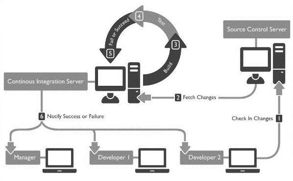
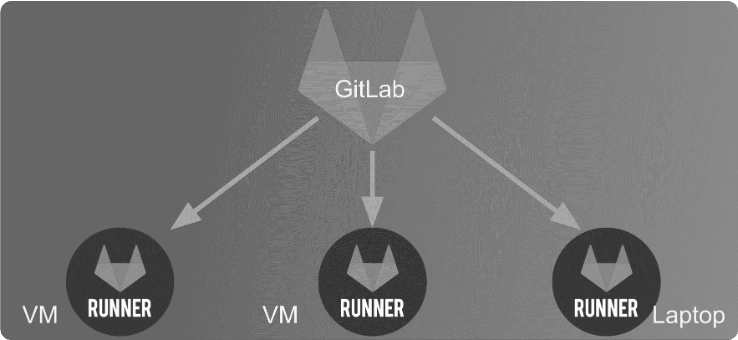

# CI/CD

## Definition



CI/CD, or Continuous Integration/Continuous Deployment, is a software development practice that involves automating the integration of code changes, testing, and deployment processes. It aims to streamline and automate the delivery pipeline, ensuring rapid and reliable software delivery.

**"Continuous integration is a software development practice where members of a team integrate their work frequently... verified by an automated build (including tests) to detect integration errors"**, *Martin fowler*

Integration in the context of CI/CD involves aligning and merging development efforts from various stages (such as development, staging, and production) to ensure that code changes seamlessly transition through these environments, maintaining consistency and reliability.

* **Development Environment**: Developers work on their individual branches, integrating code changes regularly into a shared development branch.
Continuous integration ensures that code changes from multiple developers align and work together in this environment.
* **Staging Environment**: Merged code changes from the development branch are further integrated into a staging branch or environment.
Integration here involves validating code against a staging environment that mirrors the production environment closely.
* **Production Environment**: Once validated in the staging environment, integrated code changes are deployed to the production environment.
Integration in the production environment ensures a smooth transition of tested and validated code to the live system.

## Market overview

| Service             | SCM/SVC (Version Control) | CI                   | CD                   | Issue Tracking       | Issue Boards         |
|---------------------|---------------------------|----------------------|----------------------|----------------------|----------------------|
| **Git**             | ✓                         |                      |                      |                      |                      |
| **Mercurial (Hg)**  | ✓                         |                      |                      |                      |                      |
| **Bitbucket**       | ✓                         | ✓                    | ✓                    | ✓                    | ✓                    |
| **GitHub**          | ✓                         | ✓                    | ✓                    | ✓                    | ✓                    |
| **GitLab**          | ✓                         | ✓                    | ✓                    | ✓                    | ✓                    |
| **Gitea**           | ✓                         |                      |                      |                      |                      |
| **Travis CI**       |                           | ✓                    |                      |                      |                      |
| **Jenkins**         |                           | ✓                    | ✓                    |                      |                      |
| **CircleCI**        |                           | ✓                    |                      |                      |                      |
| **Azure DevOps**    | ✓                         | ✓                    | ✓                    | ✓                    |                      |
| **GitHub Actions**  | ✓                         | ✓                    |                      | ✓                    |                      |
| **Azure DevOps Pipelines** |                   | ✓                    | ✓                    |                      |                      |
| **GitLab CI/CD**    | ✓                         | ✓                    | ✓                    | ✓                    |                      |
| **AWS CodePipeline**|                           | ✓                    | ✓                    |                      |                      |
| **Google Cloud Build** |                        | ✓                    | ✓                    |                      |                      |

## CI/CD Platform (GitHub Actions)

GitHub Actions is a CI/CD platform provided by GitHub that allows you to automate, customize, and execute your software development workflows right in your GitHub repository. It enables you to build, test, and deploy your code directly from GitHub. You can write individual tasks, called actions, and combine them to create a custom workflow.

Workflows are custom automated processes that you can set up in your repository to build, test, package, release, or deploy any code project on GitHub. These workflows are made up of one or more jobs and can be scheduled or triggered by an event.

### CI/CD features

#### Workflows and Actions

Workflows are defined in your repository as YAML files in the `.github/workflows` directory. Each workflow can contain one or more jobs, and each job runs a series of steps. A step can be either a set of shell commands or an action. Actions are reusable units of code that can be shared and used across different workflows.

Here's an example of a simple GitHub Actions workflow for a Node.js application:

```yaml
name: Node.js CI

on:
  push:
    branches: [ master ]
  pull_request:
    branches: [ master ]

jobs:
  build:

    runs-on: ubuntu-latest

    strategy:
      matrix:
        node-version: [12.x, 14.x, 16.x]

    steps:
    - uses: actions/checkout@v2
    - name: Use Node.js ${{ matrix.node-version }}
      uses: actions/setup-node@v2
      with:
        node-version: ${{ matrix.node-version }}
    - run: npm ci
    - run: npm run build --if-present
    - run: npm test
```
This workflow runs a build and test process for a Node.js application on three different versions of Node.js whenever there's a push or pull request to the master branch.

### Marketplace

GitHub provides a marketplace where developers can create, share, and use actions. This makes it easy to extend your CI/CD pipelines with functionality created by others. There are actions for deploying to various cloud platforms, running tests, code linters, security scanners, and much more.

### Integration with GitHub Features

GitHub Actions is deeply integrated with other GitHub features. You can use the `GITHUB_TOKEN` to make authenticated API calls, automatically manage issues, pull requests, and more. You can also use the secrets storage to handle sensitive data like API keys, and the artifact storage to store build results.

### CI/CD for Developers

#### Build

In the build stage, you can compile your code, create containers, or package your application. You can use actions to set up your build environment, cache dependencies, and more.

#### Test

You can run your tests in parallel, report test results, and automatically fail a workflow if a test fails. There are actions available for many testing tools and services.

#### Deploy

You can deploy your application to various cloud platforms, on-premises servers, or even GitHub Pages. There are actions available for many deployment tools and services.

### Limitations and Considerations

While GitHub Actions provides a robust platform for CI/CD, there are some limitations and considerations to keep in mind:

- Free usage of GitHub Actions is limited, and public repositories get a certain number of free minutes per month.
- While you can run actions on a variety of platforms (Windows, Linux, macOS), not all features are available on all platforms.
- While GitHub Actions is powerful, it might not cover all use cases. For more complex workflows, you might need to use a more feature-rich CI/CD platform like GitLab.

### Dependency Management in GitHub

Dependency management is a critical aspect of software development. It involves keeping track of all the software libraries and packages that your project depends on, their versions, and ensuring they are up-to-date and secure.

GitHub provides several tools and features to help manage dependencies in your projects:

#### Dependabot

Dependabot is a tool provided by GitHub that helps you keep your dependencies up-to-date. It automatically checks your project for outdated dependencies and opens pull requests to update them.

Dependabot supports several languages and package managers, including JavaScript (`npm`, `yarn`), Python (`pip`), Java (Maven), Ruby (Bundler), PHP (Composer), .NET (NuGet), and others.

Dependabot also provides security updates. When GitHub detects a vulnerable dependency in your repository, Dependabot can automatically open a pull request to update the insecure dependency to a fixed version.

To enable Dependabot security updates, you can go to the Security & analysis settings of your repository and under the Dependabot alerts, click Enable.

#### Renovate

Renovate is an open-source tool that helps automate dependency updates. It works similarly to Dependabot but offers more configuration options. Renovate can be self-hosted or used as a GitHub App.

Renovate supports a wide range of languages and package managers, including Docker, Kubernetes, Terraform, and others, in addition to those supported by Dependabot.

Renovate checks for updates and opens pull requests with updates. You can configure the frequency of updates, grouping of updates, and many other settings.

To use Renovate, you can install the Renovate GitHub App, or use the self-hosted Renovate CLI tool.

### Updatecli

Updatecli is an open-source tool designed to automate the process of updating dependencies in configuration files. It is particularly useful in a CI/CD context where dependencies need to be regularly updated to their latest versions.

Updatecli works by defining a set of rules in a configuration file. These rules specify the source to fetch the latest version, the conditions to validate the new version, and the targets to update with the new version.

Here's a basic example of an Updatecli configuration file:

```yaml
title: "Update Docker Image Version"
sources:
  dockerVersion:
    kind: dockerDigest
    spec:
      image: "ghcr.io/owner/repo"
      tag: "latest"
conditions:
  isNotSnapshot:
    kind: shell
    spec:
      command: "echo '{{ source \"dockerVersion\" }}' | grep -v SNAPSHOT"
targets:
  updateDockerfile:
    kind: yaml
    spec:
      file: "Dockerfile"
      key: "image"
```      
In this example, Updatecli fetches the latest Docker image digest from the GitHub Container Registry, checks that it's not a snapshot version, and then updates the Dockerfile with the new digest.  Updatecli can be run locally or as part of a CI/CD pipeline. It supports a variety of sources (Docker, Helm, GitHub, etc.), conditions (Shell, File, etc.), and targets (YAML, JSON, Shell, etc.), making it a flexible tool for updating dependencies in various types of projects.  To use Updatecli, you can install it locally using the provided binaries, or use the Docker image in a CI/CD pipeline.

###  Enhancing a Python Function and Adding Unit Tests

Fork and clone the [following repository](https://github.com/gounthar/learning-2024-devops-cicd-github-python.git).
In this exercise, you will need to modify existing Python code and submit your changes via a Pull Request (PR).

#### Task 1: Modify the `add2` Function

Currently, the `add2` function in `calc.py` adds two values together. Your task is to modify this function so that it can take an unlimited number of arguments and add them all together. Remember to handle the case where one of the arguments is a string.

#### Task 2: Add Unit Tests

After modifying the `add2` function, you need to add additional unit tests in `test_calc.py` to verify that your new function works correctly. Make sure to test several cases, including when no arguments are provided, when a single argument is provided, when multiple arguments are provided, and when one of the arguments is a string.

#### Task 3: Update Documentation

Finally, update the documentation in the code (comments) to reflect the changes you have made. Ensure that the documentation is clear and precise.

Once you have completed these tasks, create a new branch, commit your changes, and submit a PR. Be sure to include a detailed description of your changes in both your commit message and in the description of your PR.

Good luck!

In the next section, we will discuss GitLab, another popular CI/CD platform that offers more advanced features and capabilities.

## CI/CD Platform (GitLab)

GitLab is a comprehensive DevOps platform that provides integrated CI/CD pipelines alongside version control, issue tracking, and more. It offers robust capabilities for automating software development processes, including building, testing, and deploying applications in a collaborative environment.

Its functionalities include:

- **Version Control:** Robust Git repository management with merge requests, code review, and branching capabilities.
- **CI/CD Pipelines:** Automated build, test, and deployment pipelines for efficient software delivery.
- **Issue Tracking:** Integrated issue tracking system for project management and collaboration.
- **Collaboration Tools:** Wikis, snippets, code analytics, and merge request approvals for streamlined teamwork.
- **Project Management:** Extensive project planning, milestones, boards, and time tracking features.
- **Security Scanning:** Built-in security scanning tools for vulnerability management.
- **Container Registry:** Integrated container registry for storing Docker images.
- **Kubernetes Integration:** Seamless integration with Kubernetes for container orchestration.

### CI/CD features

#### Jobs and stages 


**Jobs:** Individual tasks defined in the `gitlab-ci.yml` file. They represent actions such as build, test, deploy, etc.
**Stages:** Divisions in the pipeline where jobs are grouped. Typical stages include build, test, deploy, allowing sequential execution.

#### `gitlab-ci.yml` Configuration

The `gitlab-ci.yml` is a configuration file at the root of your repository that defines the CI/CD pipeline, specifying jobs, stages, scripts, and configurations for the CI/CD process.

```yaml
# This is an example GitLab CI/CD configuration file

# Define the stages in the pipeline
stages:
  - build
  - test
  - deploy

# Define variables for reuse across jobs
variables:
  ENVIRONMENT: "production"
  APP_NAME: "my-app"

# Jobs definition
build_job:
  stage: build
  script:
    - echo "Building the application..."

test_job:
  stage: test
  script:
    - echo "Running tests..."
  only:
    - master  # Run this job only on the master branch

deploy_job:
  stage: deploy
  script:
    - echo "Deploying to $ENVIRONMENT..."
  environment:
    name: $ENVIRONMENT
    url: https://example.com/my-app
  only:
    - master  # Run this job only on the master branch
```

- `stages`: Defines the stages in the pipeline: build, test, deploy.
- `variables`: Declares variables for reuse across jobs (`ENVIRONMENT`, `APP_NAME`).
- `build_job`, `test_job`, `deploy_job`: Jobs with their respective stages and scripts to execute.
- `only`: Specifies that certain jobs (`test_job`, `deploy_job`) should run only on the `master` branch.
- `environment`: Defines deployment-related information like the environment name and URL for the `deploy_job`.

#### Runner Architecture



- **GitLab Runner:** independant processing power that executes CI/CD jobs defined in the `gitlab-ci.yml`. It can be installed on various platforms and supports different executor types like Shell, Docker, Kubernetes, etc.
  
- **Executor Types:** Determines how jobs are executed. For instance, Docker executor runs jobs inside Docker containers for isolated and reproducible environments.

### CI/CD for Developers

CI/CD for developers encompasses several key stages:

#### Build

The build stage involves compiling code, running automated builds, and generating artifacts or executable files from the source code.

#### Measure

Metrics and analytics are collected during the CI/CD pipeline to measure the performance and quality of the software being developed.

#### Document

Generate automatically the code documentation as your developper kit for newcomers , as SDK documentation for your client...

#### Test

Automated testing ensures that changes made to the codebase don't introduce bugs or issues. 

#### Secure

Unit test your app, make fuctionnal testing, 
Security testing helps identify and address vulnerabilities in the code.

#### Deploy

The deployment phase involves automating the process of releasing applications into production or staging environments.


## Exercises

### 🧪 Exercice 1 : Build your CI/CD server with docker

Create your gitlab onPremise service. Because gitlab is fully dockerized you are able to create a docker-compose.yml that create your platform locally.

- Create the docker-compose.yml and start your server
    - [https://docs.gitlab.com/ee/install/docker.html#install-gitlab-using-docker-compose](https://docs.gitlab.com/ee/install/docker.html#install-gitlab-using-docker-compose)
- Create a project on the local platform and push some code of your choice

::: details solution

*docker-compose.yml
```yml
*gitlab-ci.yml*
services:
  gitlab-server:
    image: 'gitlab/gitlab-ce:latest'
    hostname: 'localhost'
    ports:
      - '80:80'
      - '22:22'
      - '443:4443'
    environment:
      GITLAB_OMNIBUS_CONFIG: |
        external_url 'http://docker.for.win.localhost'
    restart: always
    volumes:
      - 'gitlab-data:/var/opt/gitlab'
      - './gitlab-data:/etc/gitlab'
      - 'gitlab-logs:/var/log/gitlab'
volumes:
  gitlab-data:
  gitlab-logs:
```
:::

::: tip Admin root password
After the service started you can retrieve the initial root password by going to  `/etc/gitlab/initial_root_password` on the gitlab server.
:::

### 🧪 Exercice 2 : Register your laptop PC as a `docker` runner to build your pipelines onPremise

Add a runner that can be the same computer 
    - [https://docs.gitlab.com/runner/install/](https://docs.gitlab.com/runner/install/)
    - [https://docs.gitlab.com/ee/tutorials/create_register_first_runner/index.html](https://docs.gitlab.com/ee/tutorials/create_register_first_runner/index.html)
Configure your pipepline (`gitlab-ci.yml`) with a single stage with an simple echo as script and test that the runner is used.

::: details solution
*add to the previous docker-compose.yml*
```yml
  runner:
   image: 'gitlab/gitlab-runner:latest'
   hostname: 'localhost'
   privileged: true
   environment:
    - DOCKER_HOST=tcp://docker.for.win.localhost:2375
   volumes:    
    - C:\gitlab-runner-data\config:/etc/gitlab-runner
```
:::

### 🧪 Exercise 3 - A full pipeline for a project of your choice on a SaaS CI/CD platform

- Please select a project of your choice (JEE, node, python, android...)
- Push the code to gitlab.com or github.com
- Write a complete pipeline with CI/CD stage and jobs by searching for the right tooling on docker HUB 
-  fill up your gitlab-ci.yml or github actions to have the 6 CI/CD steps automated ( Build, measure, document... cf. the course)

:::details solution

*A solution for a simple JAVA project*
[https://gitlab.com/brah/devops-sample-java](https://gitlab.com/brah/devops-sample-java)
:::

## 📖 Further reading
