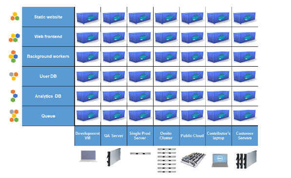
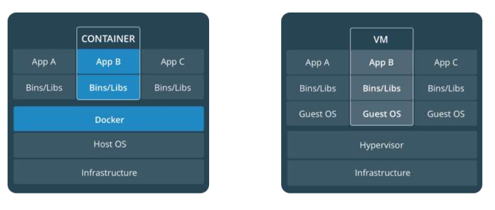
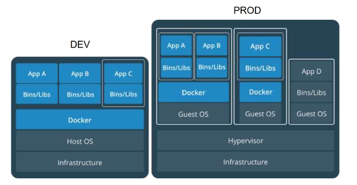
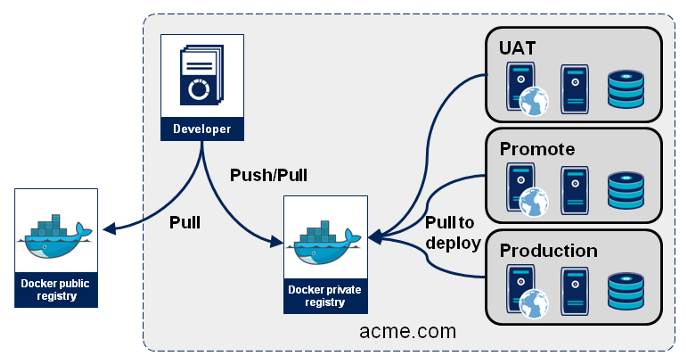
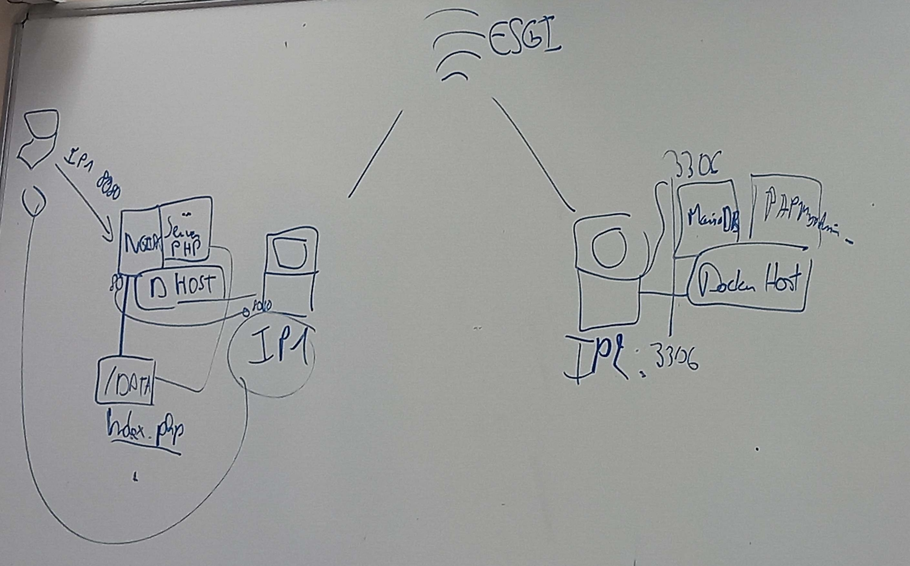

# Containerization 

## Definition

Containerization involves encapsulating applications and their dependencies into containers, allowing for efficient and consistent deployment across different environments. Containers package software in a portable, self-sufficient unit, ensuring isolation and enabling seamless deployment.

Objectives : 
* Stop the « it works on my machine » syndrom
* Be the link between dev and ops

## An old history (70s)


### What is it?

* Software based on well known linux technologies
* Yet another layers between software and hardware
* Created to ease deployment of applications
* Starting point: cargo transport

### Containers… for softwares ?

* As cargo container solved the problem of ethergenious transport mode, does software containers can solve



## The market 
* `LXC` (Linux Containers): Offers lightweight, operating-system-level virtualization, enabling multiple isolated Linux systems on a single host.
rkt (Rocket): Focuses on security and composability, providing a security-focused container runtime as an alternative to Docker.
* `Docker`: A widely used container platform enabling building, shipping, and running applications in containers, known for its user-friendly interface and comprehensive tooling.
* `Podman`: Docker alternative allowing container management without a daemon, offering a Docker-compatible command-line interface.
* `LXD` (Linux Containers Next): A container hypervisor with a REST API to manage system containers, aiming for a more user-friendly container management experience.
* `Linux-VServer`: Provides lightweight virtualization for partitioning a single server into isolated containers for security and resource control.
* `VMware vSphere Integrated Containers` (VIC)" for basic container deployment and management within VMware vSphere environments.

### What is a container ? 

## History 

### In the Dark ages : One application on One physical server


* Slow deployment times
* Huge costs
* Wasted resources
* Difficult to scale
* Difficult to migrate
* Vendor lock in

### Then, virtualization : One server, multiple apps in VMs


* Better resource pooling : One physical machine divided into multiple virtual machines
* Easier to scale
* VMs in the cloud 
    * Rapid elasticity
    * Pay as you go model


### But VMs

* Each VMs stills requires
    * CPU allocation
    * Storage
    * RAM
    * An entire guest operating system

* The more VMs you run, the more resources you need
* Guest OS means wasted resources
* Application portability not guaranteed

### Containers


* Standardized packaging for software and dependencies
* Isolate apps from each other
* Share the same OS kernel
* Works with all major Linux and Windows distributions

### Benefits

* Speed : No OS to boot = applications online in a seconds
* Portability : less dependencies between process layers = ability to move between infrastructure
* Efficiency : less OS overhead
* Improved VM density

### Virtual Machines VS Containers ?



* Containers are an app level construct
* VMs are an infrastructure level construct to turn one machine into many servers 

### Mixed architecture



* Containers and VMs together provide a tremendous amount of flexibility for IT to optimally deploy and managed apps

## Docker

### History

- **2004: Solaris containers and Zones technology introduced**

- **2008: Linux containers (LXC1.0) introduced**

- **2013: Initial Release**
  - Salomon Hykes starts docker as an internal project within dotCloud company
  - *June 2013:* Docker was released as an open-source project by dotCloud, revolutionizing application deployment through containers.

- **2014: Rapid Growth and Adoption**
  - *March 2014:* Docker 1.0 launched, gaining attention for its ease of use and portability.
  - *June 2014:* DockerCon 2014 introduced Docker Hub, a cloud-based repository for sharing container images.

- **2015: Expansion and Tooling**
  - *April 2015:* Docker 1.6 brought multi-host networking for secure communication.
  - *June 2015:* Docker Engine 1.7 introduced orchestration and scheduling tools.
  - *November 2015:* Docker Engine 1.9 enhanced networking, storage, and security.

- **2016: Maturation and Enterprise Focus**
  - *February 2016:* Docker Engine 1.10 introduced secrets management.
  - *June 2016:* Docker Datacenter launched for enterprise-scale container management.

- **2017: Further Enterprise Expansion**
  - *March 2017:* Docker Enterprise Edition (EE) consolidated Docker's commercial offering.
  - *October 2017:* Docker EE 17.06 added Kubernetes support.

- **2018-2019: Continued Enhancements**
  - *May 2018:* Docker Desktop for Mac and Windows simplified local development.
  - *April 2019:* Docker Desktop introduced Kubernetes support.

- **2020-Present: Focus on Developer Experience and Security**
  - *June 2020:* Docker 19.03 emphasized improved developer experiences.
  - *2021-2022:* Docker continued refining security, enhancing developer tools, and optimizing performance.


### Statistics 

- Docker Hub hosts millions of container images, supported by a vast community.
- Billions of downloads and adoption by millions of developers and enterprises globally.
- Remains one of the most popular containerization platforms, pivotal in container technology adoption.

Throughout its evolution, Docker transformed from a niche tool to a fundamental technology, driving container adoption due to its user-friendliness, portability, and ecosystem growth.

### Inside docker 

Written in [GO](http://golang.org)
Unique tool upon:
* **LibContainer** (using LXC as plugin : Cgroup and Namespacing) providing :
    * **Filesystem isolation**: each process container runs in a completely separate root filesystem.
    * **Resource isolation**: system resources like cpu and memory can be allocated differently to each process container, using cgroups.
    * **Network isolation**: each process container runs in its own network namespace, with a virtual interface and IP address of its own.
* **Storage Backends** (devicemapper, AUFS, BTRFS, …) providing :
   * **Layered file system**: root filesystems are created using “copy-on-write”, which makes deployment extremely fast, memory-cheap and disk-cheap.

###  Basic usage

Containerization platforms like Docker provide tools to create, deploy, and manage containers. Users can build containers from images, run them as instances, manage their lifecycle, and interact with them using container-specific commands.

- **Find ID of an Image:**
  ```bash
  docker images
  ```
  *Output:*
  ```
  REPOSITORY    TAG       IMAGE ID       CREATED       SIZE
  my_image      latest    abc123def456   2 weeks ago   500MB
  ```

- **Find ID of a Container:**
  ```bash
  docker ps -a
  ```
  *Output:*
  ```
  CONTAINER ID   IMAGE      COMMAND       CREATED       STATUS       PORTS     NAMES
  12345abcde     my_image   "/bin/bash"   3 days ago    Exited (0)             my_container
  ```

- **List Active Containers:**
  ```bash
  docker ps
  ```
  *Output:*
  ```
  CONTAINER ID   IMAGE         COMMAND       CREATED       STATUS       PORTS      NAMES
  abcdef123456   my_container  "/start.sh"   1 hour ago    Up 1 hour   80/tcp     web_server
  ```

- **List All Containers (Active and Inactive):**
  ```bash
  docker ps -a
  ```
  *Output:*
  ```
  CONTAINER ID   IMAGE         COMMAND       CREATED        STATUS      PORTS       NAMES
  abcdef123456   my_container  "/start.sh"   1 hour ago     Up 1 hour  80/tcp      web_server
  12345abcde     my_image      "/bin/bash"   3 days ago     Exited (0)              my_container
  ```

- **List Images:**
  ```bash
  docker images
  ```

- **Create a Container from an Image:**
  ```bash
  docker create [OPTIONS] IMAGE [COMMAND] [ARG...]
  ```

- **Remove a Container:**
  ```bash
  docker rm [OPTIONS] CONTAINER [CONTAINER...]
  ```

- **Run a Container:**
  ```bash
  docker run [OPTIONS] IMAGE[:TAG|@DIGEST] [COMMAND] [ARG...]
  ```

- **Port Forwarding (Map Host Port to Container Port):**
  ```bash
  docker run -p HOST_PORT:CONTAINER_PORT IMAGE_NAME
  ```

- **Remove an Image:**
  ```bash
  docker rmi [OPTIONS] IMAGE [IMAGE...]
  ```

- **Pull an Image:**
  ```bash
  docker pull [OPTIONS] NAME[:TAG|@DIGEST]
  ```

- **Execute a Command in a Running Container:**
  ```bash
  docker exec [OPTIONS] CONTAINER COMMAND [ARG...]
  ```

- **View Container Logs:**
  ```bash
  docker logs [OPTIONS] CONTAINER
  ```

- **Stop a Running Container:**
  ```bash
  docker stop [OPTIONS] CONTAINER [CONTAINER...]
  ```

### Custom image and dockerFile

#### Definition

A Docker image is a self-contained, immutable snapshot or template that includes an application's code, dependencies, and configuration, serving as the foundation to create and run containers.

#### Create a dockerFile

``` dockerfile 
# Base Image
FROM ubuntu:latest

# Maintainer Information
LABEL maintainer="Your Name <your@email.com>"

# Install Necessary Packages
RUN apt-get update && \
    apt-get install -y \
    package1 \
    package2

# Set Working Directory
WORKDIR /app

# Copy Files/Directory to Container
COPY . /app

# Expose Ports
EXPOSE 80

# Define Environment Variables
ENV ENV_VAR_NAME=value

# Run Application
CMD [ "executable" ]
```

1. `FROM ubuntu:latest`
- **`FROM`**: Specifies the base image for the new image being built.
- **`ubuntu:latest`**: Base image, in this case, Ubuntu, and `latest` tag referring to the most recent version.

2. `LABEL maintainer="Your Name <your@email.com>"`
- **`LABEL`**: Adds metadata to the image.
- **`maintainer`**: Custom label key identifying the maintainer's information.

3. `RUN apt-get update && apt-get install -y package1 package2`
- **`RUN`**: Executes commands within the container during the build process.
- **`apt-get update && apt-get install -y package1 package2`**: Updates package lists and installs specified packages.

4. `WORKDIR /app`
- **`WORKDIR`**: Sets the working directory for subsequent commands in the Dockerfile.
- **`/app`**: Directory path within the container.

5. `COPY . /app`
- **`COPY`**: Copies files or directories from the host machine to the container.
- **`.`**: Represents the current directory on the host.
- **`/app`**: Destination directory in the container.

6. `EXPOSE 80`
- **`EXPOSE`**: Informs Docker that the container listens on specific network ports at runtime.
- **`80`**: Port number exposed by the container.

7. `ENV ENV_VAR_NAME=value`
- **`ENV`**: Sets environment variables inside the container.
- **`ENV_VAR_NAME=value`**: Name-value pair for an environment variable.

8. `CMD [ "executable" ]`
- **`CMD`**: Specifies the default command to be executed when a container starts.
- **`[ "executable" ]`**: Command and its arguments to run when the container starts.


#### Building and Pushing an Image to Docker Hub

```bash
# Build Docker Image
docker build -t yourusername/repositoryname:tag .

# Log in to Docker Hub (Enter your Docker Hub credentials)
docker login

# Push Image to Docker Hub
docker push yourusername/repositoryname:tag
```

Replace placeholders:

- `yourusername`: Your Docker Hub username.
- `repositoryname`: Name for your repository on Docker Hub.
- `tag`: Tag/version for your image (e.g., `latest`).


### Registry



`Registries` store Docker **images**, acting as **repositories** where users can push, pull, and manage images. 
`Docker Hub` is a popular public registry, while private registries offer secure storage for proprietary or sensitive images within organizations.

## Multi-container 


Docker Compose is a tool for defining and running multi-container Docker applications. It uses a YAML file (docker-compose.yml) to configure services, allowing users to define multiple containers, their configurations, networks, and volumes in a single file.

### docker-compose.yml file

A Docker Compose file (`docker-compose.yml`) is used to define and run multi-container Docker applications. It's structured with key-value pairs and various keywords with YAML language defining each services

```yaml
version: '3.8'

services:
  service1:
    image: imagename:tag
    ports:
      - "host_port:container_port"
    volumes:
      - "host_path:container_path"
    environment:
      - KEY=VALUE
    command: command_to_run
```

- **`version`**: Specifies the Docker Compose file version.
- **`services`**: Defines the services or containers to be created and run.
- **`image`**: Specifies the image to use for the service.
- **`ports`**: Maps ports from the host to the container.
- **`volumes`**: Mounts volumes from the host to the container.
- **`environment`**: Sets environment variables for the service.
- **`command`**: Overrides the default command for the service.

### Basic commands

- **Start Services Defined in `docker-compose.yml`:**
  ```bash
  docker-compose up
  ```

- **Start Services in Detached Mode:**
  ```bash
  docker-compose up -d
  ```

- **Stop Services:**
  ```bash
  docker-compose down
  ```

## Exercises

### 🧪 Exercise 1

Pull HTTP apache server image from docker HUB and start your first web server containerized. Test it on your browser

::: details view the answer
```bash
# Pull the Apache HTTP Server image from Docker Hub
docker pull httpd

# Run the Apache HTTP Server container
docker run -d -p 8080:80 httpd
```
:::

### 🧪 Exercise 2

Create your custom HTTP apache server image in a dockerfile Ubuntu based that is functionnal locally and you will push it to dockerHUB

::: details view the answer
```bash

```
:::

### 🧪 Exercise 3

Create your own registry with a docker image and try to push your HTTPD image to your repository

::: details view the answer
```bash

```
:::

::: tip
You can use other repository services such as [Harbor](https://goharbor.io/)
:::


### 🧪 Exercise 4

Convert your previous HTTPD image  and container with a docker-compose.yml config

::: details view the answer
```bash

```
:::

### 🧪 Exercise 5



Create a LAMP achitecture with 2 computers over a WiFi network as follows with :
* an Apache / Nginx service
* a PHP service
* a mariaDB or MongoDB service
* a PHPMyAdmin or mongo-express

::: details view the answer
```bash

```
:::


## 📖 Further reading
- De chroot à Docker, Podman, et maintenant les modules Wasm, 40 ans d'évolution de la conteneurisation by Thomas SCHWENDER

<iframe width="560" height="315" src="https://www.youtube.com/embed/dikQOyAzdS4" title="De chroot à Docker, Podman, et maintenant les modules Wasm, 40 ans d'évolution de la conteneurisation" frameborder="0" allow="accelerometer; autoplay; clipboard-write; encrypted-media; gyroscope; picture-in-picture" allowfullscreen></iframe>