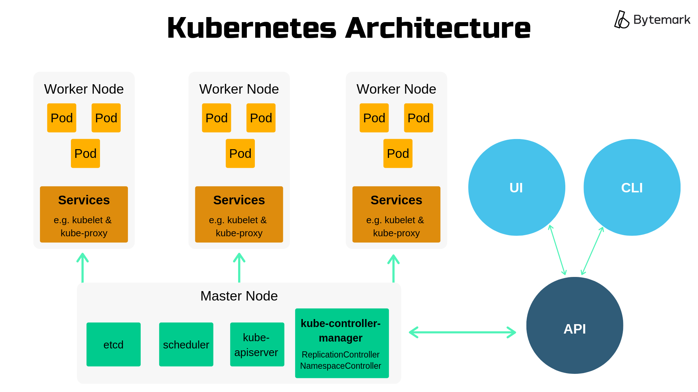
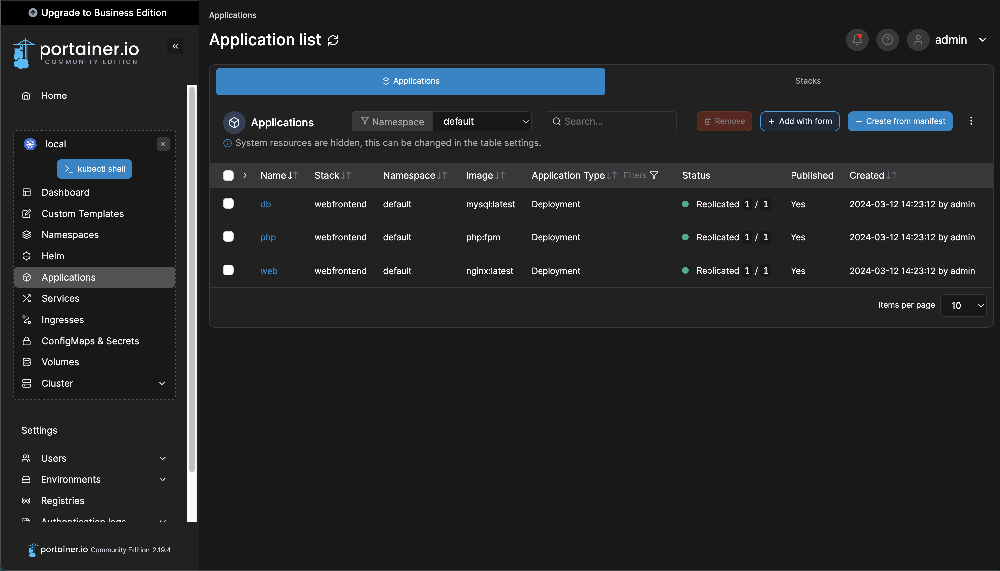

# (Orchestration)

## Definition

Orchestration in the context of DevOps refers to the automated arrangement, coordination, and management of software elements, such as containers or services, within a computing environment. It involves managing the deployment, scaling, and operation of complex applications to ensure they function efficiently and reliably.

##  Kubernetes

Kubernetes, often abbreviated as K8s, is an open-source container orchestration platform designed to automate the deployment, scaling, and management of containerized applications. It was originally developed by Google and is now maintained by the Cloud Native Computing Foundation (CNCF). Kubernetes provides a framework for automating the deployment, scaling, and management of containerized applications, allowing developers to focus on writing code rather than managing infrastructure.

### Definition : Pod 

A pod in Kubernetes is the smallest and simplest deployable unit that represents a single instance of a running process or application in the cluster. It encapsulates one or more containers, storage resources, and unique networking options. Containers within a pod share the same network namespace, allowing them to communicate with each other using localhost. Pods serve as the basic building blocks of Kubernetes deployments, providing a logical unit for managing application components and ensuring co-location and co-scheduling of tightly coupled containers. They can be horizontally scaled by creating multiple replicas of the same pod template, distributed across the cluster, to handle increased workload demands or achieve high availability.

### Architecture



The architecture of Kubernetes is based on a master-slave model:

- **Master Node**: The master node is responsible for managing the Kubernetes cluster. It orchestrates communication between nodes, schedules workloads, and maintains the desired state of the cluster. The master node consists of several components:
  - **API Server**: Exposes the Kubernetes API, which is used by administrators and clients to interact with the cluster.
  - **Controller Manager**: Monitors the state of the cluster and performs actions to maintain the desired state.
  - **Scheduler**: Assigns workloads to nodes based on resource requirements and other constraints.
  - **etcd**: Consistent and highly-available key-value store used as Kubernetes' backing store for all cluster data.

- **Worker Nodes**: Worker nodes, also known as minions, are responsible for running containerized applications. They receive instructions from the master node and execute tasks accordingly. Each worker node runs the following components:
  - **Kubelet**: An agent that runs on each node and is responsible for managing containers, including starting, stopping, and monitoring containers.
  - **Kube Proxy**: Manages network connectivity and routing for containers.
  - **Container Runtime**: Software responsible for running containers, such as Docker or containerd.


### Run your first pod in kubernetes
```bash
kubectl run nginx --image=nginx
```

### Create and Deploy a Containerized Application with a manifest

Here is an example of a Kubernetes Pod definition in YAML format:

```yaml
apiVersion: v1
kind: Pod
metadata:
  name: example-pod
  labels:
    app: example
spec:
  containers:
  - name: nginx-container
    image: nginx:latest
    ports:
    - containerPort: 80
```

Let's break down this definition:
- `apiVersion`: Specifies the Kubernetes API version being used. In this case, it's `v1`, which is the core Kubernetes API version.
- `kind`: Specifies the type of Kubernetes object being defined. Here, it's `Pod`.
- `metadata`: Contains metadata about the Pod, such as its name and labels.
  - `name`: The name of the Pod, which is `example-pod` in this case.
  - `labels`: Key-value pairs that can be used to identify and organize Pods. Here, we've applied a label with the key `app` and value `example`.
- `spec`: Defines the specification of the Pod, including its containers and other settings.
  - `containers`: A list of containers to run within the Pod.
    - `name`: The name of the container, which is `nginx-container`.
    - `image`: The Docker image to use for the container. Here, it's `nginx:latest`.
    - `ports`: Specifies the ports that the container exposes.
      - `containerPort`: The port number that the container listens on. In this example, it's `80`, which is the default port for HTTP traffic.

This Pod definition describes a single Pod named `example-pod`, running a single container based on the NGINX image (`nginx:latest`) that exposes port `80`. You can create this Pod in your Kubernetes cluster by saving the above YAML to a file (e.g., `example-pod.yaml`) and using the `kubectl apply` command:

```bash
kubectl apply -f example-pod.yaml
```

This will create the Pod in your Kubernetes cluster based on the provided definition.

### Checking Deployment Status

You can check the status of the deployment using the `kubectl get` command:

```bash
kubectl get deployments
```

This command will show you the status of all deployments in the cluster, including the `nginx-deployment` we just created.


### Login (should be already done with Rancher Desktop / Podman Desktop)
```bash
kubectl config set-context <context>
```

### Check that it did work
```bash
kubectl get pod nginx
```

### Access your pod from your localhost loopback
```bash
kubectl port-forward pods/nginx 8080:80
```

### Delete everything
```bash
kubectl delete pod nginx
```

### Scaling the Deployment

To scale the deployment, you can use the `kubectl scale` command:

```bash
kubectl scale deployment nginx-deployment --replicas=5
```

This command will scale the `nginx-deployment` to have 5 replicas.

### 4. Exposing the Deployment

To expose the deployment externally, you can create a Kubernetes service:

```bash
kubectl expose deployment nginx-deployment --type=LoadBalancer --port=80 --target-port=80
```

This command will create a LoadBalancer service that exposes the `nginx-deployment` on port 80.

## GUIs

Rancher and Portainer are both tools that provide graphical user interfaces (GUIs) for managing Kubernetes clusters, among other features. 

### **Rancher**
   
   Rancher is an open-source container management platform that provides a centralized control plane for managing multiple Kubernetes clusters, regardless of where they are deployed (on-premises, cloud, or hybrid environments). It offers features such as cluster provisioning, monitoring, logging, security, and multi-tenancy. Rancher simplifies the deployment and management of Kubernetes by providing an intuitive UI and CLI tools. It also supports other container orchestration platforms, such as Docker Swarm and Apache Mesos.

   Key features of Rancher in relation to Kubernetes include:

   - **Cluster Management**: Rancher allows you to easily provision, manage, and scale Kubernetes clusters through its user-friendly interface.
   - **Multi-Cluster Operations**: It provides tools for deploying and managing applications across multiple Kubernetes clusters, streamlining operations in complex environments.
   - **Monitoring and Logging**: Rancher offers built-in monitoring and logging capabilities to help you monitor the health and performance of your Kubernetes clusters and applications.
   - **Security**: It provides role-based access control (RBAC) and other security features to ensure the security of your Kubernetes clusters and workloads.
   - **CI/CD Integration**: Rancher integrates with popular CI/CD tools like Jenkins, GitLab CI, and Drone to enable continuous integration and delivery workflows for Kubernetes applications.

### **Portainer**:



   Portainer is an open-source container management tool designed to simplify the deployment and management of containerized applications. While it initially focused on Docker, Portainer has expanded its support to Kubernetes, enabling users to manage Kubernetes clusters through its intuitive web-based interface. Portainer offers features such as cluster management, container lifecycle management, resource utilization monitoring, and role-based access control.

   Key features of Portainer in relation to Kubernetes include:

   - **Cluster Management**: Portainer allows you to manage Kubernetes clusters and deploy applications using a visual interface, eliminating the need for complex YAML configuration files.
   - **Container Lifecycle Management**: It provides tools for managing container lifecycles, including creating, starting, stopping, and deleting containers.
   - **Resource Monitoring**: Portainer offers built-in monitoring capabilities to track resource utilization (CPU, memory, and storage) across Kubernetes clusters and individual workloads.
   - **RBAC**: It supports role-based access control (RBAC) to control user permissions and restrict access to sensitive operations within Kubernetes clusters.
   - **Integration with Docker**: Portainer seamlessly integrates with Docker, allowing users to manage both Docker and Kubernetes environments from a single interface.


