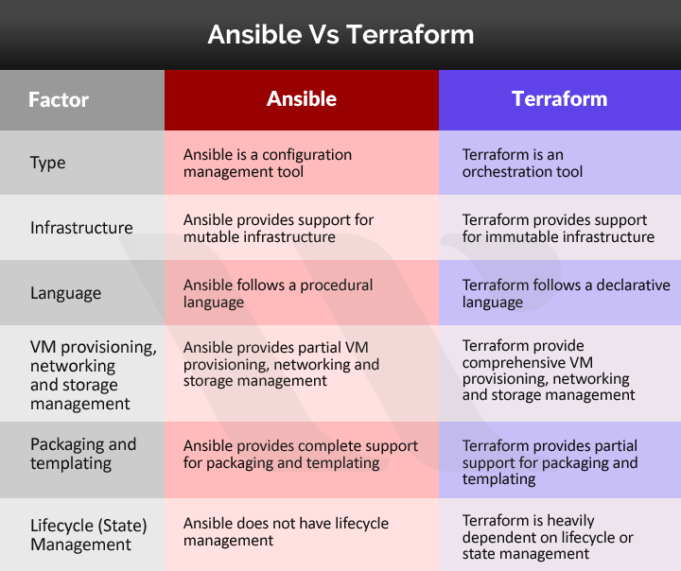

#  Provisionning

This section introduces Provisioning as a crucial step in setting up and configuring infrastructure for applications. It covers tools like Ansible and Terraform for infrastructure automation, Vagrant for creating development environments, and leveraging GitLab for automating provisioning tasks within CI/CD pipelines.

## Definitions

### Provision
Provisioning refers to the process of setting up and configuring infrastructure and resources needed for software applications to run. It involves tasks such as installing operating systems, configuring networks, and deploying applications.


### Configuration management tool
A configuration management tool is a software solution designed to automate the process of managing and maintaining the configuration of computer systems, servers, and software applications in a consistent and efficient manner.

### GitOps
GitOps is a modern operational framework that leverages Git as a single source of truth for managing infrastructure as code and the entire software delivery pipeline. It extends the principles of version control and collaboration from software development to the entire infrastructure and deployment lifecycle.

#### Key Aspects and Functions:

1. **Configuration Consistency:** These tools ensure that all systems within an infrastructure are configured consistently, reducing errors and improving reliability.

2. **Automation:** They automate the setup, configuration, and maintenance of servers and systems, minimizing manual intervention and human error.

3. **Version Control:** They often incorporate version control mechanisms, allowing administrators to track changes, roll back to previous configurations, and maintain an audit trail.

4. **Policy Enforcement:** Configuration management tools enforce organizational policies and standards across the entire infrastructure, ensuring compliance and security.

5. **Scalability:** They are scalable, capable of managing configurations across a few servers to large, complex infrastructures.

#### Common Features:

- **Infrastructure as Code (IaC):** Treats infrastructure configurations as code, allowing for easier management, reproducibility, and scalability.
  
- **Templates/Manifests/Playbooks:** These tools use configuration files (such as YAML or DSL-based scripts) to define and manage the desired state of systems.

- **Agent-Based or Agentless:** Some tools use agents installed on managed systems (like Puppet), while others operate agentlessly (like Ansible).

- **Monitoring and Reporting:** They often provide monitoring capabilities and reporting tools to track changes and system status.

#### Examples of Configuration Management Tools:

1. **Puppet:** Uses declarative language to define system configurations and manage infrastructure.

2. **Ansible:** Uses YAML-based playbooks for configuration management and automation, known for its simplicity and agentless nature.

3. **Chef:** Uses a Ruby-based DSL (Domain-Specific Language) to define system configurations and automate infrastructure.

4. **SaltStack:** Uses Python-based configuration management to control and orchestrate infrastructure.

5. **Terraform:** Focuses more on provisioning infrastructure by defining and deploying it as code, often used alongside configuration management tools.

These tools are integral in modern IT operations, enabling DevOps practices by streamlining configuration processes, reducing errors, and enhancing the reliability and scalability of systems and applications.




## Ansible

Ansible is a configuration management and automation tool that simplifies the provisioning and management of IT infrastructure. It uses YAML-based playbooks to define and automate tasks such as application deployment, configuration, and system setup across multiple servers.


### Ansible Components
- **Inventory:** Defines hosts and groups managed by Ansible.
- **Playbooks:** YAML files containing automation tasks and configurations.
- **Modules:** Predefined Ansible units performing specific tasks.
- **Roles:** Organize tasks, handlers, variables, and more for reuse.

### Installation
Install Ansible on your control machine using package managers like `apt`, `yum`, or via Python's `pip`.

::: warning
For windows users :

* [https://docs.ansible.com/ansible/latest/os_guide/windows_faq.html#windows-faq-ansible](https://docs.ansible.com/ansible/latest/os_guide/windows_faq.html#windows-faq-ansible)
* [https://docs.ansible.com/ansible-tower/latest/html/userguide/overview.html](https://docs.ansible.com/ansible-tower/latest/html/userguide/overview.html)
:::

### Inventory Setup
Create an inventory file (`inventory.ini`) defining hosts and groups:
```ini
[web]
webserver1.example.com
webserver2.example.com

[db]
database1.example.com
```

##  playbooks setup

Create a playbook (`playbook.yml`) containing tasks and configurations:
```yaml
---
- name: Configure web servers
  hosts: web
  tasks:
    - name: Ensure Apache is installed
      yum:
        name: httpd
        state: present
      become: yes

    - name: Copy Apache configuration
      copy:
        src: files/httpd.conf
        dest: /etc/httpd/conf/httpd.conf
      become: yes
      notify: restart apache

    - name: Ensure Apache is running
      service:
        name: httpd
        state: started
      become: yes

  handlers:
    - name: restart apache
      service:
        name: httpd
        state: restarted
```

Execute the playbook:
```bash
ansible-playbook -i inventory.ini playbook.yml
```

### Roles
Organize tasks, files, templates, and variables for reuse:
```bash
ansible-galaxy init myrole
```


### Ansible Vault
Encrypt sensitive data like passwords or API keys:
```bash
ansible-vault encrypt secrets.yml
```

## 🧪 Exercise

Step 1 : Make the provisionning of a web server on a VM Ubuntu of your collegue laptop over WiFi. Use a playbook for that


## Provisioning with Vagrant

Vagrant, while primarily used for creating and managing development environments, also provides built-in provisioning capabilities.
It supports multiple provisioners like Shell, Puppet, and Ansible, allowing developers to automate the setup and configuration of environments using scripts or configuration management tools.

Ansible can be use to deploy your provisionning playbooks as follow

```perl
Vagrant.configure("2") do |config|

  #
  # Run Ansible from the Vagrant Host
  #
  config.vm.provision "ansible" do |ansible|
    ansible.playbook = "playbook.yml"
  end

end
```

## 🧪 Exercise

Update your vagrant box http server with ansible provisionning instead of scripting


## Terraform

Terraform is an open-source Infrastructure as Code (IaC) tool by HashiCorp used for building, changing, and versioning infrastructure efficiently. It allows declarative configuration of cloud resources across various providers using simple, human-readable code.

### Terraform Components

**Providers:** Interfaces to interact with APIs of various cloud or service providers (AWS, Azure, GCP, etc.).
**Resources:** Declares the infrastructure components to be managed (VMs, networks, databases, etc.).
**State:** Records the current state of managed infrastructure, enabling Terraform to manage changes.

### Installation
Download and install Terraform from the official website or use package managers like `apt`, `yum`, or `choco` for installation.

### Configuration Files

Create a `main.tf` file to define infrastructure resources:

```hcl
provider "aws" {
  region = "us-west-2"
}

resource "aws_instance" "example" {
  ami           = "ami-12345678"
  instance_type = "t2.micro"
}
```

### Initialization
Run the following command to initialize the working directory:
```bash
terraform init
```

### Applying Changes
Apply the configuration defined in the `main.tf` file:
```bash
terraform apply
```

## Provisioning with GitLab and Terraform for GitOps

GitLab provides Continuous Integration/Continuous Deployment (CI/CD) capabilities that can include provisioning tasks. By utilizing GitLab CI/CD pipelines, you can automate provisioning tasks, integrating Ansible or Terraform scripts to set up and configure infrastructure as part of the deployment process.

## 🧪 Exercise

Use terraform docker image to deploy throw Gitlab a virtual machine on AWS.
Use puppet to provision an http server on it