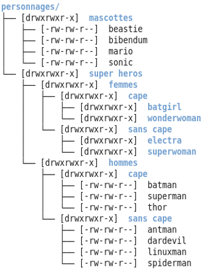

# Shell for DevOps

## Linux Filesystem

In a Linux distribution, several critical directories hold essential system files, configurations, and user data. Among these, `/etc`, `/var`, `/bin`, `/usr`, and `/home` are some of the most important directories.

`/etc`: This directory contains system-wide configuration files. It houses crucial settings for various services, software applications, and the system itself. Files such as `/etc/passwd` (user account information), `/etc/apt/sources.list` (APT package manager configuration), and `/etc/hostname` (system hostname) reside here. Administrators often tweak settings in this directory to manage system behavior and software configurations.

`/var`: This directory stores variable data generated by running processes. It includes files that change frequently during system operation, such as logs (`/var/log`), databases (`/var/lib`), mail (`/var/mail`), and temporary files (`/var/tmp`). System logs and application data often reside here, offering insights into system health and performance.

`/bin` and `/usr`: These directories contain executable binaries and essential system commands. `/bin` holds fundamental commands crucial for system booting and repair, while `/usr/bin` contains standard user commands and binaries for installed software.

`/home`: This directory houses user home directories. Each user typically has a dedicated subdirectory (`/home/username`) storing their personal files, configurations, and settings. It's a critical space for user-specific data, allowing customization and privacy for individual users.

These directories form the backbone of a Linux system, encompassing critical configurations, system data, executable files, and user-specific information essential for the system's functionality and user experience.

```bash
├── bin                         # Essential system binaries.
│   ├── /bin                    # Core command binaries.
│   ├── /sbin                   # System binaries for administration tasks.
│   └── /usr                    # Additional user binaries.
│       └── /usr/bin            # User command binaries.
├── boot                        # Boot-related files.
│   ├── /boot/grub              # GRUB bootloader files and config.
│   └── /boot/kernel            # Kernel and related files.
├── dev                         # Device files representing hardware devices.
│   ├── /dev/pts                # Pseudo-terminal devices.
│   └── /dev/shm                # Shared memory files and objects.
├── etc                         # System-wide configuration files.
│   ├── /etc/network            # Network configuration files.
│   ├── /etc/apt                # APT package manager configuration.
│   └── /etc/default            # Default config for various applications.
├── home                        # User home directories.
│   ├── /home/user1             # Individual user directories.
│   └── /home/user2
├── lib                         # Essential shared libraries.
├── media                       # Mount point for removable media.
├── mnt                         # Temporary mount point for additional filesystems.
├── opt                         # Optional third-party software.
├── proc                        # Virtual filesystem providing process-related info.
├── root                        # Home directory for the root user.
├── run                         # System information since the last boot.
│   └── /run/user               # User-specific runtime info.
├── sbin                        # System binaries for administration tasks.
├── srv                         # Site-specific data served by the system.
├── sys                         # Virtual filesystem with hardware device info.
├── tmp                         # Temporary files, deleted upon reboot.
├── usr                         # User-related programs and resources.
│   ├── /usr/local              # Locally installed software.
│   └── /usr/share              # Architecture-independent data.
└── var                         # Variable data, logs, caches, temporary files.
    ├── /var/log                # System log files.
    └── /var/cache              # Cached data from installed packages.
```

You can displays the directory structure in a tree-like format.

**Example:**
```bash
tree
```


## File permissions 

In Linux distributions, file permissions and ownership are managed through a robust system known as "rights management." This system controls access to files and directories, ensuring security and privacy across the system. Each file and directory has associated permissions determining who can read, write, or execute them. These permissions are categorized for three types of users: the file owner, the user group associated with the file, and others.

### Read file permisions

When you use `ls -l` in a terminal, you'll see an output similar to this:

```bash
-rwxr-xr-- 1 user group 4096 Jan 1 12:00 example.txt
```

Let's break down what each part of this output signifies:

- **File Permissions:** The `-rwxr-xr--` part represents permissions for the file.
  - The first character indicates file type (`-` for a regular file).
  - The next nine characters (`rwxr-xr--`) denote permissions for owner, group, and others.
    - The first three characters represent owner permissions (`rwx`).
    - The next three represent group permissions (`r-x`).
    - The last three represent permissions for others (`r--`).

- **File Owner and Group:** The `user` is the file's owner, and `group` is the group associated with the file.

- **File Size, Date, and Name:** The `4096 Jan 1 12:00 example.txt` part shows the file size, modification date, and file name.

#### Interpreting Permissions

- `r` denotes read permission.
- `w` denotes write permission.
- `x` denotes execute permission.
- `-` denotes lack of a specific permission.

For instance, in `-rwxr-xr--`:
- The owner (`rwx`) has read, write, and execute permissions.
- The group (`r-x`) has read and execute permissions.
- Others (`r--`) have only read permission.

This visual representation from `ls -l` allows you to quickly interpret file permissions and understand who has access to read, write, and execute the file.

### Changing Permissions

Permissions are modified using commands like `chmod`. For example, granting read and write permissions to the owner and group of a file named `example.txt`:

```bash
chmod ug+rw example.txt
```

### Ownership Management

Ownership is altered using `chown`. To change the owner of `example.txt` to `newowner`:

```bash
chown newowner example.txt
```

```bash
#!/bin/bash

# Changing permissions
chmod ug+rw example.txt

# Changing ownership
chown newowner example.txt
```

This script demonstrates using `chmod` and `chown` to modify file permissions and ownership, ensuring proper management and security within a Linux environment.

### Octal notation

Octal notation simplifies permission settings using three digits, each representing permission types for owner, group, and others.

For instance:
- `chmod 755 file.txt` sets:
  - Owner: Read (4) + Write (2) + Execute (1) = 7
  - Group and Others: Read (4) + Execute (1) = 5

This notation streamlines permission management, facilitating precise access control in Linux.

## Basic Commands

#### `cd`

Change directory.

**Example:**
```bash
cd /path/to/directory
```

#### `ls`

List directory contents.

**Example:**
```bash
ls -l
```

- `-l`: Long format, displaying detailed information.

#### `pwd`

Print working directory.

**Example:**
```bash
pwd
```

## Package Managers

#### `apt`

Package manager for Debian-based systems.

**Example:**
```bash
apt update
```

- `update`: Updates the package index.

**Config Files:** 
- `sources.list`: Contains a list of repository URLs used by `apt`.
- `/etc/apt/sources.list.d/`: Additional sources for `apt`.

**Removing Packages:** 
- `apt remove package_name`: Removes a package.
- `apt purge package_name`: Removes a package along with its configuration files.

#### `yum`

Package manager for RPM-based systems like CentOS.

**Example:**
```bash
yum install package_name
```

**Config Files:** 
- `/etc/yum.conf`: Main configuration file for `yum`.
- `/etc/yum.repos.d/`: Directory containing repository configuration files.

**Removing Packages:** 
- `yum remove package_name`: Removes a package.

#### `dnf`

Package manager, newer version of `yum`, used in Fedora.

**Example:**
```bash
dnf search keyword
```

**Config Files:** 
- `/etc/dnf/dnf.conf`: Main configuration file for `dnf`.
- `/etc/yum.repos.d/`: Directory containing repository configuration files.

**Removing Packages:** 
- `dnf remove package_name`: Removes a package.

#### `pacman`

Package manager for Arch Linux.

**Example:**
```bash
pacman -Syu
```

- `-Syu`: Synchronizes package databases and upgrades installed packages.

**Config Files:** 
- `/etc/pacman.conf`: Main configuration file for `pacman`.
- `/etc/pacman.d/`: Directory containing repository configuration files.

**Removing Packages:** 
- `pacman -R package_name`: Removes a package.

## Network Debugging

### `ping`

Test connectivity to a remote host.

**Example:**
```bash
ping google.com
```

### `ssh`

Securely connect to a remote server.

**Example:**
```bash
ssh username@hostname
```

### `telnet`

Communicate with another host using the Telnet protocol (less secure).

**Example:**
```bash
telnet example.com 80
```

### `wget`

Retrieve content from web servers via HTTP, HTTPS, FTP.

**Example:**
```bash
wget https://example.com/file.tar.gz
```

### `ip`

The `ip` command is used for showing/manipulating routing, network devices, interfaces, and tunnels in Unix-like operating systems.

To display network interfaces and their addresses, use the following command:

```bash
ip address show
```

Output:

```
1: lo: <LOOPBACK,UP,LOWER_UP> mtu 65536 qdisc noqueue state UNKNOWN group default qlen 1000
   inet 127.0.0.1/8 scope host lo
      valid_lft forever preferred_lft forever
   inet6 ::1/128 scope host
      valid_lft forever preferred_lft forever
2: eth0: <BROADCAST,MULTICAST,UP,LOWER_UP> mtu 1500 qdisc fq_codel state UP group default qlen 1000
   inet 192.168.1.100/24 brd 192.168.1.255 scope global eth0
      valid_lft forever preferred_lft forever
   inet6 fe80::5054:ff:fe11:2233/64 scope link
      valid_lft forever preferred_lft forever
```


### `dig`

The `dig` command is used for querying DNS servers for various DNS records.

To query DNS records for a domain, use the following command:

```bash
dig example.com
```

Output:

```
; <<>> DiG 9.10.6 <<>> example.com
;; global options: +cmd
;; Got answer:
;; ->>HEADER<<- opcode: QUERY, status: NOERROR, id: 58283
;; flags: qr rd ra; QUERY: 1, ANSWER: 1, AUTHORITY: 0, ADDITIONAL: 1

;; OPT PSEUDOSECTION:
; EDNS: version: 0, flags:; udp: 512
;; QUESTION SECTION:
;example.com.            IN  A

;; ANSWER SECTION:
example.com.        604800  IN  A   93.184.216.34

;; Query time: 1 msec
;; SERVER: 192.168.1.1#53(192.168.1.1)
;; WHEN: Mon Feb 07 18:23:10 PST 2024
;; MSG SIZE  rcvd: 55
```

### `host`

The `host` command is used to perform DNS lookups. It retrieves domain name to IP address mappings by querying DNS servers.

To perform a DNS lookup for a domain name, use the following command:

```bash
host example.com
```

Output:

```
example.com has address 93.184.216.34
example.com has IPv6 address 2606:2800:220:1:248:1893:25c8:1946
```

## Processes & Services

#### `ps`

Display information about running processes.

**Example:**
```bash
ps aux
```

- `aux`: Display all processes with a user-oriented format.


When you run the `ps` command in Unix-like operating systems, it displays information about active processes. Among the various columns of information, you might see a column labeled `PD`. This column represents the "Parent Process ID" or "PPID".

The Parent Process ID refers to the Process ID (PID) of the parent process that spawned the current process. In other words, it indicates which process is the parent of the process listed in the current row.

For example, if you see a `pd` value of `1234`, it means that the process listed in that row was created by the process with PID `1234`.

Understanding the parent-child relationship between processes can be crucial for troubleshooting and analyzing system behavior. It helps in determining how processes are related and how they interact with each other.

Here's an example of the output of the `ps` command with the `pd` column:

```
  PID   PPID  CMD
  1001  999   bash
  1002  1001  └─── ls
  1003  1001  └─── ps
```

Process with PID `1001` (bash) is the parent process of processes with PIDs `1002` (ls) and `1003` (ps).
Processes `ls` and `ps` were spawned by the `bash` process.


#### `top` or `htop`

Monitoring tools to view system processes and resource usage.

**Example:**
```bash
top
```

- `Shift + M`: Sort by memory usage in `top`.
- `F6` (in `htop`): Sort by various fields.

#### Cron tab


Cron is a task scheduling utility for Unix and Unix-like systems. It allows users to schedule commands or scripts to run periodically at specified intervals.

To edit the cron configuration file:
```sh
crontab -e
```

```plaintext
* * * * * command_to_execute
```

The general syntax for configuring a task in a cron tab is as follows, where the five asterisks (*) represent respectively:
    - Minute (0-59)
    - Hour (0-23)
    - Day of the month (1-31)
    - Month (1-12)
    - Day of the week (0-7, 0 and 7 represent Sunday)

You can verify that the task has been added correctly using the `crontab -l` command.

#### SystemD

Systemd is a service and process management system for Linux systems. It offers advanced features such as parallel startup, dependency management, service monitoring, and more.

Configuring a service with systemd involves creating a `.service` file that specifies the service's settings. Here's an example of a basic service file:

```plaintext
[Unit]
Description=Service Description

[Service]
Type=Service Type
ExecStart=/path/to/command_to_execute
Restart=Restart Policy

[Install]
WantedBy=default.target
```

- `[Unit]`: Section containing metadata about the service.
- `[Service]`: Section describing the service itself.
- `[Install]`: Section specifying how the service should be installed.

To refresh the list of systemd services:

```shell
sudo systemctl daemon-reload
```

To Start your service:

```shell
sudo systemctl start mon_service
```

To Check the status of your service:

```shell
sudo systemctl status mon_service
```

Console Output:
```shell
● mon_service.service - My demonstration service
   Loaded: loaded (/etc/systemd/system/mon_service.service; enabled; vendor preset: enabled)
   Active: active (running) since Sat 2024-02-14 10:00:00 CET; 5s ago
 Main PID: 12345 (mon_script.sh)
    Tasks: 1 (limit: 4915)
   Memory: 10.0M
   CGroup: /system.slice/mon_service.service
           └─12345 /path/to/mon_script.sh

Feb 14 10:00:00 hostname systemd[1]: Started My demonstration service.
```

You can also configure a Timer associated with your service:

1. Create a timer file named `mon_service.timer` in the directory `/etc/systemd/system/`:

```shell
sudo nano /etc/systemd/system/mon_service.timer
```

2. Add the following content to the file:

```plaintext
[Unit]
Description=My timer for mon_service

[Timer]
OnCalendar=*-*-* 00:00:00
Unit=mon_service.service

[Install]
WantedBy=timers.target
```

In this example, `OnCalendar=*-*-* 00:00:00` means the timer will trigger every day at midnight.

To start your timer: 
```shell
sudo systemctl daemon-reload
sudo systemctl enable mon_service.timer
sudo systemctl start mon_service.timer
```

To check the status of your timer:

```shell
sudo systemctl status mon_service.timer
```

## Others

#### `grep`

Search for specific patterns in files.

**Example:**
```bash
grep "pattern" file.txt
```

- `-i`: Ignore case distinctions.
- `-r`: Recursively search subdirectories.
- `-n`: Show line numbers.

#### `sed`

Stream editor for modifying and formatting text.

**Example:**
```bash
sed 's/old_text/new_text/' file.txt
```

- `'s/old_text/new_text/'`: Substitute `old_text` with `new_text`.
- `-i`: Edit files in place.

#### `awk`

Text processing tool for extracting and manipulating data.

**Example:**
```bash
awk '{print $1}' file.txt
```

- `'{print $1}'`: Print the first field of each line.
- `-F`: Set field separator.


#### `git`


Version control system for tracking changes in code.

**Example:**
```bash
git clone repository_url
```
- `clone`: Clone a repository.
- `add`: Add file contents with the index.
- `commit`: create a new commit from the current index
- `push`: push local commit to the remote branch
- `pull`: retrieve commits from the remote branch


## Exercises

Requirement For Windows :
Linux subsystem for windows : https://learn.microsoft.com/fr-fr/windows/wsl/install


### 🧪 Exercise 1 - File System Management 

**Objective:** Create a script that organizes files in a directory, lists permissions, and performs basic operations as follow



1. It seems that "linuxman" is not a superhero. In fact, he is called "Tux" and should be located in the "mascots" directory. Using the "mv" command, move the file "linuxman" to "tux" in the mascots directory.
2. Rename the directory "superheroes" to "comics".
3. Using the "echo" command: write into the file "batman" the content "Bruce Wayne hides behind this character".
4. Using the "echo" command: append to the file "batman" the content "he lives in Gotham".
5. Using the "echo" command: write into the file "dardevil" the content "Homer Simpson hides behind this character".
6. Oh no, it's not Homer. With the "echo" command, overwrite the content of the file "dardevil" with the content "Dardevil is a blind comic character".
7. Using the "cat" command, in a single command, copy the contents of the "batman" and "dardevil" files into the "mascots/mixdarbat" file.
8. Switch to root mode.
9. Create a user named "fanboy".
10. Copy the directory "characters" into /home/fanboy.
11. Use the "chown" command to change the owner and group of this directory.
12. Create a symbolic link "persofanboy" pointing to /home/fanboy/characters.
13. Create a symbolic link "perso_yourname" pointing to /home/yourname/characters.
14. Using the "ls" command, save the complete tree structure of /home/fanboy/characters into a file "14.txt".
15. In the file "14.txt", you will find lines with the word "total". Using the grep command, copy the contents of the file "14.txt" into the file "15.txt" by removing occurrences of the word "total".
16. Save the last 250 lines of your history in the file "myhistory" by removing any lines where you used the "cd" command. You will use the grep command again.

### 🧪  Exercise 2  - Cron ( Unix machines only)
Add a cron that recreate the root folder "personnages" at your user home each 5 min with a suffix number ( personnages_9h05, personnages_9h10...)


### 🧪 Exercise 3 - SystemD ( Unix machines only)
Add the script as a linux service with the same rule, each 5 min with a suffix number ( personnages_9h05, personnages_9h10...)

### 🧪 Exercice 4  - Git
1. Create an account on gitlab.com
2. Create a project
3. push this code to the project


### 🧪  Exercice 5 - onPremise Web server

Create an apache Web server and a MariaDB  by pair with 2 laptops as follow. Serve a simple php content  connected to the MariaDB with PDO https://www.php.net/manual/fr/book.pdo.php


Use `ping`, `telnet`, `ip` during your services deployment


