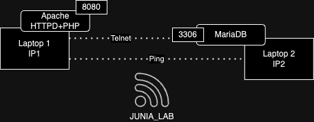

# Shell for DevOps

## Linux Filesystem

In a Linux distribution, several critical directories hold essential system files, configurations, and user data. Among these, `/etc`, `/var`, `/bin`, `/usr`, and `/home` are some of the most important directories.

`/etc`: This directory contains system-wide configuration files. It houses crucial settings for various services, software applications, and the system itself. Files such as `/etc/passwd` (user account information), `/etc/apt/sources.list` (APT package manager configuration), and `/etc/hostname` (system hostname) reside here. Administrators often tweak settings in this directory to manage system behavior and software configurations.

`/var`: This directory stores variable data generated by running processes. It includes files that change frequently during system operation, such as logs (`/var/log`), databases (`/var/lib`), mail (`/var/mail`), and temporary files (`/var/tmp`). System logs and application data often reside here, offering insights into system health and performance.

`/bin` and `/usr`: These directories contain executable binaries and essential system commands. `/bin` holds fundamental commands crucial for system booting and repair, while `/usr/bin` contains standard user commands and binaries for installed software.

`/home`: This directory houses user home directories. Each user typically has a dedicated subdirectory (`/home/username`) storing their personal files, configurations, and settings. It's a critical space for user-specific data, allowing customization and privacy for individual users.

These directories form the backbone of a Linux system, encompassing critical configurations, system data, executable files, and user-specific information essential for the system's functionality and user experience.

```bash
├── bin                         # Essential system binaries.
│   ├── /bin                    # Core command binaries.
│   ├── /sbin                   # System binaries for administration tasks.
│   └── /usr                    # Additional user binaries.
│       └── /usr/bin            # User command binaries.
├── boot                        # Boot-related files.
│   ├── /boot/grub              # GRUB bootloader files and config.
│   └── /boot/kernel            # Kernel and related files.
├── dev                         # Device files representing hardware devices.
│   ├── /dev/pts                # Pseudo-terminal devices.
│   └── /dev/shm                # Shared memory files and objects.
├── etc                         # System-wide configuration files.
│   ├── /etc/network            # Network configuration files.
│   ├── /etc/apt                # APT package manager configuration.
│   └── /etc/default            # Default config for various applications.
├── home                        # User home directories.
│   ├── /home/user1             # Individual user directories.
│   └── /home/user2
├── lib                         # Essential shared libraries.
├── media                       # Mount point for removable media.
├── mnt                         # Temporary mount point for additional filesystems.
├── opt                         # Optional third-party software.
├── proc                        # Virtual filesystem providing process-related info.
├── root                        # Home directory for the root user.
├── run                         # System information since the last boot.
│   └── /run/user               # User-specific runtime info.
├── sbin                        # System binaries for administration tasks.
├── srv                         # Site-specific data served by the system.
├── sys                         # Virtual filesystem with hardware device info.
├── tmp                         # Temporary files, deleted upon reboot.
├── usr                         # User-related programs and resources.
│   ├── /usr/local              # Locally installed software.
│   └── /usr/share              # Architecture-independent data.
└── var                         # Variable data, logs, caches, temporary files.
    ├── /var/log                # System log files.
    └── /var/cache              # Cached data from installed packages.
```

You can displays the directory structure in a tree-like format.

**Example:**
```bash
tree
```


## Permissions 

In Linux distributions, file permissions and ownership are managed through a robust system known as "rights management." This system controls access to files and directories, ensuring security and privacy across the system. Each file and directory has associated permissions determining who can read, write, or execute them. These permissions are categorized for three types of users: the file owner, the user group associated with the file, and others.

#### Read file permisions

When you use `ls -l` in a terminal, you'll see an output similar to this:

```bash
-rwxr-xr-- 1 user group 4096 Jan 1 12:00 example.txt
```

Let's break down what each part of this output signifies:

- **File Permissions:** The `-rwxr-xr--` part represents permissions for the file.
  - The first character indicates file type (`-` for a regular file).
  - The next nine characters (`rwxr-xr--`) denote permissions for owner, group, and others.
    - The first three characters represent owner permissions (`rwx`).
    - The next three represent group permissions (`r-x`).
    - The last three represent permissions for others (`r--`).

- **File Owner and Group:** The `user` is the file's owner, and `group` is the group associated with the file.

- **File Size, Date, and Name:** The `4096 Jan 1 12:00 example.txt` part shows the file size, modification date, and file name.

- `r` denotes read permission.
- `w` denotes write permission.
- `x` denotes execute permission.
- `-` denotes lack of a specific permission.

For instance, in `-rwxr-xr--`:
- The owner (`rwx`) has read, write, and execute permissions.
- The group (`r-x`) has read and execute permissions.
- Others (`r--`) have only read permission.

This visual representation from `ls -l` allows you to quickly interpret file permissions and understand who has access to read, write, and execute the file.

#### Changing Permissions

Permissions are modified using commands like `chmod`. For example, granting read and write permissions to the owner and group of a file named `example.txt`:

```bash
chmod ug+rw example.txt
```

#### Ownership Management

Ownership is altered using `chown`. To change the owner of `example.txt` to `newowner`:

```bash
chown newowner example.txt
```

```bash
#!/bin/bash

# Changing permissions
chmod ug+rw example.txt

# Changing ownership
chown newowner example.txt
```

This script demonstrates using `chmod` and `chown` to modify file permissions and ownership, ensuring proper management and security within a Linux environment.

#### Octal notation

Octal notation simplifies permission settings using three digits, each representing permission types for owner, group, and others.

For instance:
- `chmod 755 file.txt` sets:
  - Owner: Read (4) + Write (2) + Execute (1) = 7
  - Group and Others: Read (4) + Execute (1) = 5

This notation streamlines permission management, facilitating precise access control in Linux.

## Navigation

#### `cd`

Change directory.

```bash
cd /path/to/directory
```

#### `ls`

List directory contents.

```bash
user@host:/$ ls /path/to/directory
bin  boot  dev  etc  home  initrd.img  initrd.img.old  lib  lib32  lib64  libx32  lost+found  media  mnt  opt  proc  root  run  sbin  srv  sys  tmp  usr  var  vmlinuz  vmlinuz.old
```

- `-l`: Long format, displaying detailed information.

#### `pwd`

Print working directory.

```bash
$ cd /etc
$ pwd
/etc
```

#### `which`

Locates an executable file in your shell’s search path.

```bash
usaer@host:~$ which java
/usr/bin/java
```

## Package Managers

#### `apt`

Package manager for Debian-based systems.

```bash
apt update
```

- `update`: Updates the package index.

**Config Files:** 
- `/etc/apt/sources.list`: Contains a list of repository URLs used by `apt`.
- `/etc/apt/sources.list.d/`: Additional sources for `apt`.

**Removing Packages:** 
- `apt remove package_name`: Removes a package.
- `apt purge package_name`: Removes a package along with its configuration files.

#### `yum`

Package manager for RPM-based systems like CentOS.

```bash
yum install package_name
```

**Config Files:** 
- `/etc/yum.conf`: Main configuration file for `yum`.
- `/etc/yum.repos.d/`: Directory containing repository configuration files.

**Removing Packages:** 
- `yum remove package_name`: Removes a package.

#### `dnf`

Package manager, newer version of `yum`, used in Fedora.

```bash
dnf search keyword
```

**Config Files:** 
- `/etc/dnf/dnf.conf`: Main configuration file for `dnf`.
- `/etc/yum.repos.d/`: Directory containing repository configuration files.

**Removing Packages:** 
- `dnf remove package_name`: Removes a package.

#### `pacman`

Package manager for Arch Linux.

```bash
pacman -Syu
```

- `-Syu`: Synchronizes package databases and upgrades installed packages.

**Config Files:** 
- `/etc/pacman.conf`: Main configuration file for `pacman`.
- `/etc/pacman.d/`: Directory containing repository configuration files.

**Removing Packages:** 
- `pacman -R package_name`: Removes a package.

##  Shell Scripting

- Create a `.sh`file
- add the following header inside it 
```bash
#!/bin/bash
# Put your command to execute HERE
echo "HelloWorld !"
```
- Add the right of execution to the file 
```shell
chmod +x myscript.sh
```
- You can now execute the script
```bash
./myscript.sh
HelloWorld !
```

#### Passing argument to a bash shell script

*count_line.sh*
``` bash
#!/bin/bash
nlines=$(wc -l < $1)
echo "There are $nlines lines in $1"
```

```shell
./count_lines.sh    /etc/group
There are 73 lines in /etc/group
```

## Processes & Services

#### `ps`

Display information about running processes.

**Example:**
```bash
ps aux
```

- `aux`: Display all processes with a user-oriented format.


When you run the `ps` command in Unix-like operating systems, it displays information about active processes. Among the various columns of information, you might see a column labeled `PD`. This column represents the "Parent Process ID" or "PPID".

The Parent Process ID refers to the Process ID (PID) of the parent process that spawned the current process. In other words, it indicates which process is the parent of the process listed in the current row.

For example, if you see a `pd` value of `1234`, it means that the process listed in that row was created by the process with PID `1234`.

Understanding the parent-child relationship between processes can be crucial for troubleshooting and analyzing system behavior. It helps in determining how processes are related and how they interact with each other.

Here's an example of the output of the `ps` command with the `pd` column:

```
  PID   PPID  CMD
  1001  999   bash
  1002  1001  └─── ls
  1003  1001  └─── ps
```

Process with PID `1001` (bash) is the parent process of processes with PIDs `1002` (ls) and `1003` (ps).
Processes `ls` and `ps` were spawned by the `bash` process.


#### `top` or `htop`
Monitoring tools to view system processes and resource usage.

**Example:**
```bash
top
```

- `Shift + M`: Sort by memory usage in `top`.
- `F6` (in `htop`): Sort by various fields.

#### Chrono table (Cron or CronTab)

Cron is a task scheduling utility for Unix and Unix-like systems. It allows users to schedule commands or scripts to run periodically at specified intervals.

To edit the cron configuration file:
```sh
crontab -e
```

```plaintext
* * * * * command_to_execute
```

The general syntax for configuring a task in a cron tab is as follows, where the five asterisks (*) represent respectively:
    - Minute (0-59)
    - Hour (0-23)
    - Day of the month (1-31)
    - Month (1-12)
    - Day of the week (0-7, 0 and 7 represent Sunday)

You can verify that the task has been added correctly using the `crontab -l` command.

#### SystemD

::: tip for MacOS
Use LaunchAgent or LaunchDaemon service implementation [here](https://developer.apple.com/library/archive/documentation/MacOSX/Conceptual/BPSystemStartup/Chapters/CreatingLaunchdJobs.html)
:::

Systemd is a service and process management system for Linux systems. It offers advanced features such as parallel startup, dependency management, service monitoring, and more.

Configuring a service with systemd involves creating a `.service` file that specifies the service's settings. Here's an example of a basic service file:

```plaintext
[Unit]
Description=Service Description

[Service]
Type=Service Type
ExecStart=/path/to/command_to_execute
Restart=Restart Policy

[Install]
WantedBy=default.target
```

- `[Unit]`: Section containing metadata about the service.
- `[Service]`: Section describing the service itself.
- `[Install]`: Section specifying how the service should be installed.

To refresh the list of systemd services:

```shell
sudo systemctl daemon-reload
```

To Start your service:

```shell
sudo systemctl start mon_service
```

To Check the status of your service:

```shell
sudo systemctl status mon_service
```

Console Output:
```shell
● mon_service.service - My demonstration service
   Loaded: loaded (/etc/systemd/system/mon_service.service; enabled; vendor preset: enabled)
   Active: active (running) since Sat 2024-02-14 10:00:00 CET; 5s ago
 Main PID: 12345 (mon_script.sh)
    Tasks: 1 (limit: 4915)
   Memory: 10.0M
   CGroup: /system.slice/mon_service.service
           └─12345 /path/to/mon_script.sh

Feb 14 10:00:00 hostname systemd[1]: Started My demonstration service.
```

You can also configure a Timer associated with your service:

1. Create a timer file named `mon_service.timer` in the directory `/etc/systemd/system/`:

```shell
sudo nano /etc/systemd/system/mon_service.timer
```

2. Add the following content to the file:

```plaintext
[Unit]
Description=My timer for mon_service

[Timer]
OnCalendar=*-*-* 00:00:00
Unit=mon_service.service

[Install]
WantedBy=timers.target
```

In this example, `OnCalendar=*-*-* 00:00:00` means the timer will trigger every day at midnight.

To start your timer: 
```shell
sudo systemctl daemon-reload
sudo systemctl enable mon_service.timer
sudo systemctl start mon_service.timer
```

To check the status of your timer:

```shell
sudo systemctl status mon_service.timer
```

## Network Debugging

#### `ping`

Test connectivity to a remote host.

**Example:**
```bash
ping google.com
```

#### `ssh`

Securely connect to a remote server.

**Example:**
```bash
ssh username@hostname
```

#### `telnet`

Communicate with another host using the Telnet protocol (less secure).

**Example:**
```bash
telnet example.com 80
```


####  `netstat` 

The `netstat` command is a network utility tool used to display network connections, routing tables, interface statistics. It provides information about network connections and routing tables, which can be useful for troubleshooting network-related issues.

Display all TCP and UDP connections:
```sh
netstat -a
```

Display TCP connections with numerical addresses:
```sh
netstat -t -n
```

Display routing table:
```sh
netstat -r
```

Display listening TCP sockets:
```sh
netstat -l -t
```

#### `wget`

Retrieve content from web servers via HTTP, HTTPS, FTP.

**Example:**
```bash
wget https://example.com/file.tar.gz
```

#### `ip`

The `ip` command is used for showing/manipulating routing, network devices, interfaces, and tunnels in Unix-like operating systems.

To display network interfaces and their addresses, use the following command:

```bash
ip address show
```

Output:

```
1: lo: <LOOPBACK,UP,LOWER_UP> mtu 65536 qdisc noqueue state UNKNOWN group default qlen 1000
   inet 127.0.0.1/8 scope host lo
      valid_lft forever preferred_lft forever
   inet6 ::1/128 scope host
      valid_lft forever preferred_lft forever
2: eth0: <BROADCAST,MULTICAST,UP,LOWER_UP> mtu 1500 qdisc fq_codel state UP group default qlen 1000
   inet 192.168.1.100/24 brd 192.168.1.255 scope global eth0
      valid_lft forever preferred_lft forever
   inet6 fe80::5054:ff:fe11:2233/64 scope link
      valid_lft forever preferred_lft forever
```


#### `dig`

The `dig` command is used for querying DNS servers for various DNS records.

To query DNS records for a domain, use the following command:

```bash
dig example.com
```

Output:

```
; <<>> DiG 9.10.6 <<>> example.com
;; global options: +cmd
;; Got answer:
;; ->>HEADER<<- opcode: QUERY, status: NOERROR, id: 58283
;; flags: qr rd ra; QUERY: 1, ANSWER: 1, AUTHORITY: 0, ADDITIONAL: 1

;; OPT PSEUDOSECTION:
; EDNS: version: 0, flags:; udp: 512
;; QUESTION SECTION:
;example.com.            IN  A

;; ANSWER SECTION:
example.com.        604800  IN  A   93.184.216.34

;; Query time: 1 msec
;; SERVER: 192.168.1.1#53(192.168.1.1)
;; WHEN: Mon Feb 07 18:23:10 PST 2024
;; MSG SIZE  rcvd: 55
```

#### `host`

The `host` command is used to perform DNS lookups. It retrieves domain name to IP address mappings by querying DNS servers.

To perform a DNS lookup for a domain name, use the following command:

```bash
host example.com
```

Output:

```
example.com has address 93.184.216.34
example.com has IPv6 address 2606:2800:220:1:248:1893:25c8:1946
```

## Others

#### `grep`

Search for specific patterns in files.

**Example:**
```bash
grep "pattern" file.txt
```

- `-i`: Ignore case distinctions.
- `-r`: Recursively search subdirectories.
- `-n`: Show line numbers.

#### `sed`

Stream editor for modifying and formatting text.

**Example:**
```bash
sed 's/old_text/new_text/' file.txt
```

- `'s/old_text/new_text/'`: Substitute `old_text` with `new_text`.
- `-i`: Edit files in place.

#### `awk`

Text processing tool for extracting and manipulating data.

**Example:**
```bash
awk '{print $1}' file.txt
```

- `'{print $1}'`: Print the first field of each line.
- `-F`: Set field separator.


#### `git`


Version control system for tracking changes in code.

**Example:**
```bash
git clone repository_url
```
- `clone`: Clone a repository.
- `add`: Add file contents with the index.
- `commit`: create a new commit from the current index
- `push`: push local commit to the remote branch
- `pull`: retrieve commits from the remote branch

## Exercises

::: tip Requirement For Windows 
Linux subsystem for windows [here](https://learn.microsoft.com/fr-fr/windows/wsl/install)
:::

### 🧪 Exercise 1 - File System Management 

**Objective:** Create a script that organizes files in a directory, lists permissions, and performs basic operations as follow

```bash
[drwxr-xr-x ]  personnages
├── [drwxrwxr-x ]  mascottes
│   ├── [-rw-r--r-- ]  beastie
│   ├── [-rw-r--r-- ]  bibendum
│   ├── [-rw-r--r-- ]  mario
│   └── [-rw-r--r-- ]  sonic
└── [drwxr-xr-x ]  super heros
    ├── [drwxr-xr-x ]  femmes
    │   ├── [drwxrwxr-x ]  cape
    │   │   ├── [drwxrwxr-x ]  batgirl
    │   │   └── [drwxrwxr-x ]  wonderwoman
    │   └── [drwxrwxr-x ]  sans cape
    │       ├── [drwxrwxr-x ]  electra
    │       └── [drwxrwxr-x ]  superwoman
    └── [drwxr-xr-x ]  hommes
        ├── [drwxrwxr-x ]  cape
        │   ├── [-rw-r--r-- ]  batman
        │   ├── [-rw-r--r-- ]  superman
        │   └── [-rw-r--r-- ]  thor
        └── [drwxrwxr-x ]  sans cap
            ├── [-rw-r--r-- ]  antman
            ├── [-rw-r--r-- ]  daredevil
            ├── [-rw-r--r-- ]  linuxman
            └── [-rw-r--r-- ]  spiderman
```

Don't you forget to add the right permissions to the script file...

:::details solution
```bash
#!/bin/bash

# This script creates a directory structure and files for a fictional character hierarchy.
# The directories and files are created based on the arrays `directories` and `files`.
# The root directory can be specified as an argument when running the script.
# If no argument is provided, the current directory is used as the root.

# Check if a root directory is specified as an argument
# If not, use the current directory as the root
root_dir="${1:-.}"

# Define the directory structure
# Each element in the `directories` array represents a directory path
directories=(
    "$root_dir/personnages/mascottes"
    "$root_dir/personnages/super heros/femmes/cape"
    "$root_dir/personnages/super heros/femmes/sans cape"
    "$root_dir/personnages/super heros/hommes/cape"
    "$root_dir/personnages/super heros/hommes/sans cape"
    "$root_dir/personnages/super heros/femmes/cape/batgirl"
    "$root_dir/personnages/super heros/femmes/cape/wonderwoman"
    "$root_dir/personnages/super heros/femmes/sans cape/electra"
    "$root_dir/personnages/super heros/femmes/sans cape/superwoman"
)

# Define the files to be created
# Each element in the `files` array represents a file path
files=(
    "$root_dir/personnages/mascottes/beastie"
    "$root_dir/personnages/mascottes/bibendum"
    "$root_dir/personnages/mascottes/mario"
    "$root_dir/personnages/mascottes/sonic"
    "$root_dir/personnages/super heros/hommes/cape/batman"
    "$root_dir/personnages/super heros/hommes/cape/superman"
    "$root_dir/personnages/super heros/hommes/cape/thor"
    "$root_dir/personnages/super heros/hommes/sans cape/antman"
    "$root_dir/personnages/super heros/hommes/sans cape/daredevil"
    "$root_dir/personnages/super heros/hommes/sans cape/linuxman"
    "$root_dir/personnages/super heros/hommes/sans cape/spiderman"
)

# Create directories
# For each directory in the `directories` array, create the directory with permissions set to 775
for dir in "${directories[@]}"; do
    mkdir -m 775 -p "$dir"
done

# Create files
# For each file in the `files` array, create the file with permissions set to 664
# If the `file` variable is empty, print an error message and skip the file creation
for file in "${files[@]}"; do
    if [[ -n "$file" ]]; then
        echo "Creating file: $file"  # Log the file being created
        touch "$file"
        chmod 664 "$file"  # Change permissions to 664
    else
        echo "Error: file variable is empty"
    fi
done

# Display the permissions of the created directories and files using the `ls` command
ls -lR --color=auto "$root_dir/personnages"

```
:::

### 🧪 Exercise 1-Bis - File System Management

1. It seems that "linuxman" is not a superhero. In fact, he is called "Tux" and should be located in the "mascots" directory. Using the "mv" command, move the file "linuxman" to "tux" in the mascots directory.
2. Rename the directory "superheroes" to "comics".
3. Using the "echo" command: write into the file "batman" the content "Bruce Wayne hides behind this character".
4. Using the "echo" command: append to the file "batman" the content "he lives in Gotham".
5. Using the "echo" command: write into the file "daredevil" the content "Homer Simpson hides behind this character".
6. Oh no, it's not Homer. With the "echo" command, overwrite the content of the file "daredevil" with the content "daredevil is a blind comic character".
7. Using the "cat" command, in a single command, copy the contents of the "batman" and "daredevil" files into the "mascots/mixdarbat" file.
8. Switch to root mode.
9. Create a user named "fanboy".
10. Copy the directory "characters" into /home/fanboy.
11. Use the "chown" command to change the owner and group of this directory.
12. Create a symbolic link "persofanboy" pointing to /home/fanboy/characters.
13. Create a symbolic link "perso_yourname" pointing to /home/yourname/characters.
14. Using the "ls" command, save the complete tree structure of /home/fanboy/characters into a file "14.txt".
15. In the file "14.txt", you will find lines with the word "total". Using the grep command, copy the contents of the file "14.txt" into the file "15.txt" by removing occurrences of the word "total".
16. Save the last 250 lines of your history in the file "myhistory" by removing any lines where you used the "cd" command. You will use the grep command again.

Don't you forget to add the right permissions to the script file...

:::details solution
```bash
#!/bin/bash

# 1. Move linuxman to tux in mascots directory
mkdir -p personnages/mascottes
mv personnages/super\ heros/hommes/sans\ cape/linuxman personnages/mascottes/tux

# 2. Rename the directory superheroes to comics
mv personnages/super\ heros personnages/comics

# 3. Write into the file batman
echo "Bruce Wayne hides behind this character" > personnages/comics/hommes/cape/batman

# 4. Append to the file batman
echo "He lives in Gotham" >> personnages/comics/hommes/cape/batman

# 5. Write into the file daredevil
echo "Homer Simpson hides behind this character" > personnages/comics/hommes/sans\ cape/daredevil

# 6. Overwrite the content of the file daredevil
echo "DareDevil is a blind comic character" > personnages/comics/hommes/sans\ cape/daredevil

# 7. Copy the contents of batman and daredevil into mascots/mixdarbat
cat personnages/comics/hommes/cape/batman personnages/comics/hommes/sans\ cape/daredevil > personnages/mascottes/mixdarbat

# 9. Create a user named "fanboy"
# If the user already exists, ignore the error
sudo useradd -m fanboy || true

# 10. Copy the directory characters into /home/fanboy
# Use sudo to ensure you have the necessary permissions
sudo cp -r personnages /home/fanboy

# 11. Change owner and group of the directory
# Use sudo to ensure you have the necessary permissions
sudo chown -R fanboy:fanboy /home/fanboy/personnages

# 12. Create a symbolic link "persofanboy" pointing to /home/fanboy/characters
# Use sudo to ensure you have the necessary permissions
# Add the -f option to force the creation of the symbolic link
sudo ln -sf /home/fanboy/personnages /home/fanboy/persofanboy

# 13. Create a symbolic link "perso_yourname" pointing to /home/yourname/characters
# Replace "yourname" with your actual username
yourname=$(whoami)  # Get the current username
cp -r personnages /home/$yourname/
# Add the -f option to force the creation of the symbolic link
sudo ln -sf /home/$yourname/personnages /home/$yourname/perso_$yourname

# 14. Save the complete tree structure of /home/fanboy/characters into 14.txt
# Use sudo to ensure you have the necessary permissions
sudo apt install -y tree
sudo tree /home/fanboy/personnages > 14.txt

# 15. Remove occurrences of the word "directories" from 14.txt and save into 15.txt
grep -v "directories" 14.txt > 15.txt

# 16. Save the last 250 lines of history into myhistory, removing lines with "cd" command
# Use the HISTFILE environment variable to get the path to your .bash_history file
history_file_path=$HISTFILE
if [[ -f $history_file_path ]]; then
    grep -v "cd" $history_file_path | tail -n 250 > myhistory
else
    echo "Error: .bash_history file does not exist"
fi

```
:::

### 🧪  Exercise 2  - Cron (Unix machines only)
Add a cron that recreate the root folder "personnages" at your user home each 5 min with a suffix number ( personnages_9h05, personnages_9h10...)

:::details solution
``` shell
crontab -e
```

``` bash
*/5 * * * * /bin/bash /path/to/your/script.sh /root/folder/$(date +\%Y-\%m-\%d)
```
:::

### 🧪  Exercise 2-Bis - Cron on GitPod

Unfortunately, Gitpod does not support `cron` jobs because it's a cloud-based development environment and each workspace is ephemeral.
This means that the workspace does not maintain state between sessions, so any `cron` jobs you set up would be lost when the workspace is stopped.
However, you can install `cron` in your Gitpod workspace using` apt-get.`
Please note that even though you can install and start the cron daemon, it will not persist after the workspace is stopped.
Here's how you can install and start cron:
    
```bash
sudo apt-get update
sudo apt-get install cron
sudo service cron start
```
After running these commands, you can verify that cron is running by using the following command:
```bash
sudo service cron status
```
You can then create a cron job by creating a script that will add an entry to the crontab:
```bash
#!/bin/bash

# Define the crontab entry
CRON_ENTRY="*/5 * * * * /bin/bash /path/to/your/script.sh /root/folder/\$(date +\%Y-\%m-\%d)"

# Add the entry to crontab
(crontab -l; echo "$CRON_ENTRY" ) | crontab -
```

Of course, you will have to modify the script so `/path/to/your/script.sh` points to your earlier `bash` script that creates the root folder "personnages" at your user home.
The whole script could then look like:

```bash
#!/usr/bin/env bash

# This script sets up a cron job that runs a specific script every 5 minutes.
# The script that is run is `personnages.sh`, located in the current working directory.
# The cron job passes a timestamped directory name as an argument to `personnages.sh`.

# Update the package lists for upgrades and new package installations
sudo apt-get update

# Install the cron package
sudo apt-get install cron

# Start the cron service
sudo service cron start

# Check the status of the cron service
sudo service cron status

# Define the script path
# This is the path to the script that the cron job will run.
# It's set to `personnages.sh` in the current working directory.
SCRIPT_PATH="$(pwd)/personnages.sh"

# Define the date format
# This is the format of the timestamp that will be appended to the directory name.
# It includes the year, month, day, hour, and minute.
DATE_FORMAT="\$(date +\%Y-\%m-\%d-\%H-\%M)"

# Define the crontab entry
# This is the cron job that will be added to the crontab.
# It runs the `personnages.sh` script every 5 minutes, passing a timestamped directory name as an argument.
CRON_ENTRY="*/5 * * * * /bin/bash $SCRIPT_PATH $HOME/personnages-$DATE_FORMAT"

# Add the entry to crontab
# This command adds the defined cron job to the crontab.
# It first lists the existing crontab entries, then appends the new entry, and finally installs the new crontab.
(crontab -l; echo "$CRON_ENTRY" ) | crontab -

```

### 🧪  Exercise 2-Ter - Make Cron available on GitPod from the start

To make `cron` available on GitPod from the start, you need to customize the Docker image used by GitPod.
I know, we have not talked about Docker yet, but it is a containerization platform that allows you to create custom images with the tools and dependencies you need.
This can be done by creating a `.gitpod.Dockerfile` in your repository with the necessary commands to install cron.
Here is an example of what your `.gitpod.Dockerfile` could look like:

```Dockerfile
# This Dockerfile is used to create a custom Gitpod workspace image.
# Gitpod is a service that provides ready-to-code development environments in the cloud.

# The base image is gitpod/workspace-python, which includes a python development environment.
FROM gitpod/workspace-python

# Switch to the root user to have the necessary permissions for the following operations.
USER root

# Install cron and tree packages.
# Cron is a time-based job scheduler in Unix-like operating systems.
# Tree is a recursive directory listing program that produces a depth-indented listing of files.
# The apt-get update command is used to download package information from all configured sources.
# The apt-get install command is used to install the specified packages.
RUN apt-get update && apt-get install -y cron tree

# Start the cron service.
# The service command is used to run a System V init script.
RUN service cron start

```

This `Dockerfile` starts from the `gitpod/workspace-python` image, which is a standard image provided by GitPod that includes a python development environment.
It then switches to the `root` user to install `cron` and start the `cron` service.
Next, you need to reference this `Dockerfile` in your `.gitpod.yml` configuration file. 
Here is an example of what your `.gitpod.yml` could look like:

```yaml
# This is the .gitpod.yml configuration file for Gitpod.
# Gitpod is a service that provides ready-to-code development environments in the cloud.

# The 'image' field specifies the Docker image to use for the workspace.
# The 'file' field under 'image' points to the Dockerfile that defines the Docker image.
image:
  file: .gitpod.Dockerfile

# The 'tasks' field is a list of tasks to run when the workspace starts.
# Each task can have 'init' and 'command' fields.
# The 'init' field is a command that is run when the workspace is first initialized.
# The 'command' field is a command that is run after the 'init' command.
tasks:
  # This task makes all .sh files in any subdirectory of the current directory executable.
  - init: chmod +x ./*/*.sh

```

Why would we need to make all script executable?
You're maybe working with a Windows machine and you need to make the script executable before running it.
The permissions in Windows aren't the same as in Unix-based systems, so you need to set the executable permission explicitly.
You can do it through `git` though, but it's a bit more complicated.
Git has a feature called Git attributes that allows you to define attributes on a per-path basis.
You can use this feature to change the file permissions of specific files in your repository.

To make a file executable in Git, you need to use the `update-index` command with the `--chmod=+x` option. Here's how you can do it:
  
```bash
git update-index --chmod=+x path_to_your_file
```
Replace `path_to_your_file` with the path to the file you want to make executable.

After running this command, the file will be marked as executable in the Git repository.
The next time you or someone else checks out this file from the Git repository (at least, with operating systems that can deal correctly with file permissions), it will have the executable permission.

Remember to commit this change and push it to the remote repository:
    
```bash
git commit -m "Make file executable"
git push
```

### 🧪 Exercise 3 - SystemD ( Linux machines only)

Add the script as a linux service with the same rule, each 5 min with a suffix number ( personnages_9h05, personnages_9h10...)

::: tip For MacOS
Use LaunchAgent or LaunchDaemon service implementation [here](https://developer.apple.com/library/archive/documentation/MacOSX/Conceptual/BPSystemStartup/Chapters/CreatingLaunchdJobs.html)
:::

:::details solution

*/etc/systemd/system/folder_creation.service*
```bash
[Unit]
Description=Folder Creation Service
After=network.target

[Service]
Type=oneshot
ExecStart=/bin/bash /path/to/your/script.sh /root/folder/$(date +\%Y-\%m-\%d)

[Install]
WantedBy=multi-user.target
```

*/etc/systemd/system/folder_creation.timer*
```bash
[Unit]
Description=Folder Creation Timer

[Timer]
OnUnitActiveSec=5m
Unit=folder_creation.service

[Install]
WantedBy=timers.target
```

```bash
sudo systemctl daemon-reload
sudo systemctl start folder_creation.timer
sudo systemctl enable folder_creation.timer
```

:::

### 🧪 Exercice 4  - Git

:::tip learn more about git
[Learn Git Branching ](https://learngitbranching.js.org/?locale=fr_FR)
[Github cheatsheet](https://training.github.com/downloads/fr/github-git-cheat-sheet.pdf)
:::

1. Create an account on github.com
2. Create a project
3. push this code to the project

### What about a short quiz now?

[Quiz](https://www.opinionstage.com/page/81b097da-2053-4634-b6b9-70ea5c801236)

### 🧪  Exercice 5 - onPremise Web server
Create an Apache Web server and a MariaDB by pairing them with 2 laptops as follows.
Serve a simple PHP content connected to the MariaDB with [PDO](https://www.php.net/manual/fr/book.pdo.php).



Use `ping`, `telnet`, `ip`, `netstat` during your services deployment

::: tip Some network recalls  

**What happens when you type a URL into your browser?**
<iframe width="560" height="315" src="https://www.youtube.com/embed/AlkDbnbv7dk" title="What happens when you type a URL into your browser?" frameborder="0" allow="accelerometer; autoplay; clipboard-write; encrypted-media; gyroscope; picture-in-picture" allowfullscreen></iframe>

**What Is REST API? Examples And How To Use It**
<iframe width="560" height="315" src="https://www.youtube.com/embed/-mN3VyJuCjM" title="What Is REST API? Examples And How To Use It" frameborder="0" allow="accelerometer; autoplay; clipboard-write; encrypted-media; gyroscope; picture-in-picture" allowfullscreen></iframe>

**(SSL, TLS, HTTPS Explained)**
<iframe width="560" height="315" src="https://www.youtube.com/embed/j9QmMEWmcfo" title="SSL, TLS, HTTPS Explained" frameborder="0" allow="accelerometer; autoplay; clipboard-write; encrypted-media; gyroscope; picture-in-picture" allowfullscreen></iframe>


**(HTTP/1 to HTTP/2 to HTTP/3)**
<iframe width="560" height="315" src="https://www.youtube.com/embed/a-sBfyiXysI" title="HTTP/1 to HTTP/2 to HTTP/3" frameborder="0" allow="accelerometer; autoplay; clipboard-write; encrypted-media; gyroscope; picture-in-picture" allowfullscreen></iframe>

https://github.com/gitpod-io/gitpod/issues/736#issuecomment-658879847
:::

:::details solution
```bash
#!/bin/bash

# Update package index
sudo apt update

# Install Apache
sudo apt install -y apache2

# Start Apache service
sudo systemctl start apache2

# Enable Apache service to start on boot
sudo systemctl enable apache2

# Install Telnet
sudo apt install -y telnet

# Install Ping (usually pre-installed)
# If not installed, you can install with:
# sudo apt install -y iputils-ping

# Check Apache status
sudo systemctl status apache2

# Test Apache reachability
echo "Testing Apache reachability..."
if curl -s -I localhost:80 | grep "HTTP/1.1 200 OK" > /dev/null; then
    echo "Apache is reachable."
else
    echo "Apache is not reachable."
fi

# Test Telnet reachability
echo "Testing Telnet reachability..."
if telnet localhost 80 | grep "Escape character is" > /dev/null; then
    echo "Telnet is reachable."
else
    echo "Telnet is not reachable."
fi

# Test Ping reachability
echo "Testing Ping reachability..."
if ping -c 4 localhost | grep "4 packets transmitted, 4 received" > /dev/null; then
    echo "Ping is reachable."
else
    echo "Ping is not reachable."
fi
```

### 🧪  Exercice 5-Bis - GitPod Web server

Let's create a simple web server with an associated database using GitPod.
What is the main difference between this exercise and the previous one?
What is the main hiccup you may encounter?

#### 🚀 Make mariadb available outside of GitPod

By default, GitPod workspaces are isolated and not accessible from the public internet.
This means that services running inside a GitPod workspace are not directly reachable from outside the workspace.
Go to our [repository](https://github.com/gounthar/DevOpsGitGuide-Shell-Exercice-5-MariaDB) and click on the GitPod button (you have installed the [GitPod extension](https://www.gitpod.io/docs/configure/user-settings/browser-extension), right?).
If you don't, you can click on the following link: [](https://gitpod.io/?autostart=true#https://github.com/gounthar/DevOpsGitGuide-Shell-Exercice-5-MariaDB).

There aren't many options to make a database available outside of GitPod.
One way to achieve this is to use a tunneling service like [ngrok](https://ngrok.com/).
Ngrok allows you to expose local servers behind NATs and firewalls to the public internet over secure tunnels.
First, you need to install ngrok in your GitPod workspace.
You're lucky, it's already [part of your workspace](https://github.com/gounthar/DevOpsGitGuide-Shell-Exercice-5-MariaDB/blob/main/.gitpod.Dockerfile#L47).

Now, you have to open an account on [ngrok](https://ngrok.com/signup), and you will get an authentication token.
Once you have it, you can add the authentication token to your ngrok configuration using the following command:
```bash
ngrok config add-authtoken 2h6McmucvaInNhFsdfsffsd54564Kgf3_7adbmgRez1zbaumkvDkxX
```
Once you have ngrok installed, you can expose your MariaDB server to the public internet using the following command:
```bash
ngrok tcp 3306
```

You should then see a public URL that you can use to connect to your MariaDB server from outside GitPod.

```bash
ngrok                                                                                                                                                                                                                                                                                                                                                                                       (Ctrl+C to quit)

New guides https://ngrok.com/docs/guides/site-to-site-apis/

Session Status                online                                                                                                                                                                                                                                                                                                                                                                        
Account                       Bruno Verachten (Plan: Free)                                                                                                                                                                                                                                                                                                                                                  
Version                       3.10.0                                                                                                                                                                                                                                                                                                                                                                        
Region                        Europe (eu)                                                                                                                                                                                                                                                                                                                                                                   
Web Interface                 http://127.0.0.1:4040                                                                                                                                                                                                                                                                                                                                                         
Forwarding                    tcp://6.tcp.eu.ngrok.io:17183 -> localhost:3306

Connections                   ttl     opn     rt1     rt5     p50     p90                                                                                                                                                                                                                                                                                                                                   
0       0       0.00    0.00    0.00    0.00
```

For those of you who already have docker, it's now time to test your MariaDB connection from your local machine.
```bash
docker run -it --rm mariadb mariadb --host 6.tcp.eu.ngrok.io -P 17183 --user example-user --password
```
#### 🚀 Run Apache inside GitPod

To run Apache inside GitPod, you can go to the following [repository](https://github.com/gounthar/DevOpsGitGuide-Shell-Exercice-5-Apache) and click on the GitPod button (you have installed the [GitPod extension](https://www.gitpod.io/docs/configure/user-settings/browser-extension), right?).
If you don't, you can click on the following link: [](https://gitpod.io/new/?autostart=true#https://github.com/gounthar/DevOpsGitGuide-Shell-Exercice-5-Apache).
You should see on the bottom right corner of your screen a message like "A service is available on port 80. Open Preview".
You should then see a frame open within your current GitPod workspace showing the Apache default page.
Now in the GitPod terminal, you can run the following command to check the Apache status:
```bash
sudo service apache2 status
```
You can also test the reachability of Apache using the following command:
```bash
curl -s -I localhost:80 | grep "HTTP/1.1 200 OK"
```
You can go one level further and test the reachability of Apache using Telnet:
```bash
telnet localhost 80
GET / HTTP/1.0

```

Now, what about trying to connect to your MariaDB server from your Apache server?
```bash
mysql -h 6.tcp.eu.ngrok.io -P 17183 -u example-user -p
Enter password: 
Welcome to the MariaDB monitor.  Commands end with ; or \g.
Your MariaDB connection id is 34
Server version: 10.6.16-MariaDB-0ubuntu0.22.04.1 Ubuntu 22.04

Copyright (c) 2000, 2018, Oracle, MariaDB Corporation Ab and others.

Type 'help;' or '\h' for help. Type '\c' to clear the current input statement.

MariaDB [(none)]> 
```

Or even lower, you can try to connect to your MariaDB server through telnet:
```bash
telnet 6.tcp.eu.ngrok.io 17183
Trying 3.124.142.205...
Connected to 6.tcp.eu.ngrok.io.
Escape character is '^]'.
j
5.5.5-10.6.16-MariaDB-0ubuntu0.22.04.1!z/x2.0EI�~`Ds:dia-[c_mysql_native_password
```

Let's access the built-in PHP page from Apache to check the connection to MariaDB.
```bash
curl -s localhost/index.php
```

Nothing is happening. Why?
Let's have a look at the logs:
```bash
sudo tail -f /var/log/apache2/error.log &
```

### 🧪  Exercise 6 - SSH

By pair create an [ssh server](https://www.openssh.com/) on a laptop and try to connect from the other laptop.

:::details solution
```bash
#!/bin/bash

# Update package index
sudo apt update

# Install OpenSSH server
sudo apt install -y openssh-server

# Start OpenSSH service
sudo systemctl start ssh

# Enable OpenSSH service to start on boot
sudo systemctl enable ssh

# Install Ping (if not already installed)
sudo apt install -y iputils-ping

# Replace 'remote_ip_address' with the IP address of the remote computer
remote_ip_address="REMOTE_IP_ADDRESS"

# Test Ping reachability to the remote computer
echo "Testing Ping reachability to $remote_ip_address ..."
if ping -c 4 $remote_ip_address | grep "4 packets transmitted, 4 received" > /dev/null; then
    echo "Ping to $remote_ip_address is successful."
else
    echo "Ping to $remote_ip_address failed."
    exit 1
fi

# Attempt SSH connection to the remote computer
echo "Attempting SSH connection to $remote_ip_address ..."
if ssh $remote_ip_address -o ConnectTimeout=10 true; then
    echo "SSH connection to $remote_ip_address successful."
else
    echo "SSH connection to $remote_ip_address failed."
fi
:::


