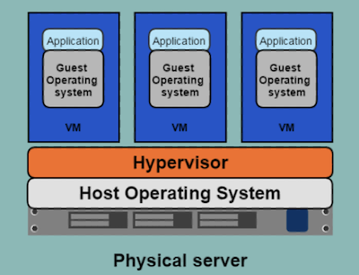
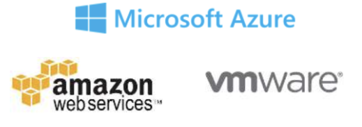
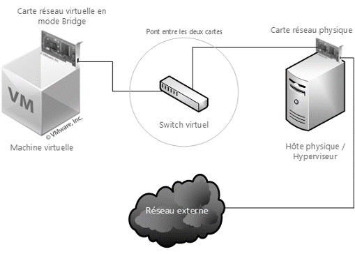
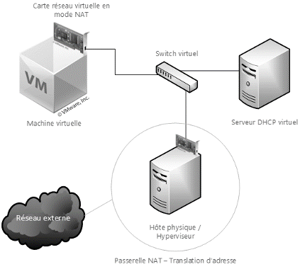
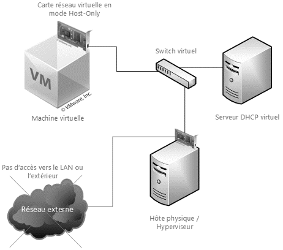

# Virtualization

This section covers essential concepts and tools related to virtualization, exploring different types of hypervisors, networking setups, scripting for virtual environment management, and tools like Vagrant for streamlined development environments.

## Definition

Virtualization refers to the creation of virtual (rather than physical) versions of computing resources, including operating systems, servers, storage devices, and networks. It enables the efficient utilization of hardware by allowing multiple virtual instances to run on a single physical machine.

## History 

### In the Dark ages : One application on One physical server


* Slow deployment times
* Huge costs
* Wasted resources
* Difficult to scale
* Difficult to migrate
* Vendor lock in

### Then, virtualization : One server, multiple apps in VMs



* Better resource pooling : One physical machine divided into multiple virtual machines
* Easier to scale
* VMs in the cloud 
    * Rapid elasticity
    * Pay as you go model



### But VMs

* Each VMs stills requires
    * CPU allocation
    * Storage
    * RAM
    * An entire guest operating system

* The more VMs you run, the more resources you need
* Guest OS means wasted resources
* Application portability not guaranteed


## What is an hypervisor ?

* A **hypervisor** or **virtual machine monitor (VMM)** is a piece of computer software, firmware or hardware that creates and runs virtual machines.
* A computer on which a hypervisor is running one or more virtual machines is defined as a **host machine**.
* Each virtual machine is called a **guest machine**

2 types :
* **Type 1** hypervisor is installed directly on bare-metal hardware, it doesn't require an additional OS, it is the OS, even it it is a light or minimal OS.

* **Type 2** is more of an application installed on an operating system and not directly on the bare-metal. Ex: VirtualBox and Vmware Workstation

    * Advantages: Run on a greater array of HW because the underlying Host OS is controlling HW access, Easy user interface, Data can be secured on the desktop.
    * Disadvantages: Decreased security, Loss of Centralized Management, Lower VM Density, Cannot support as many VMs are the first type. 

## Hypervisor Type II

Hypervisor Type II, also known as a hosted hypervisor, runs on top of an existing operating system. It allows users to create and manage virtual machines (VMs) without modifying the host system. Popular examples include VirtualBox and VMware Workstation.

### Networks

In virtualization, networks can be configured to facilitate communication between virtual machines, allowing them to share data and resources. Network configurations within virtual environments play a crucial role in creating isolated or interconnected setups, influencing communication and security between VMs.


#### Bridge

A bridge is created between the virtual network card of the virtualization application and the network card of your physical host.

The operating system of your physical host shares its physical card with the operating system of your virtual machine(s).

You must select only one network card from the host machine per point. To communicate, it will require a TCP/IP configuration identical to the other devices on the network




#### NAT

Principle of a NAT gateway: masking the IP address of the clients connected to it to exit onto the network.
Transparent access to the local network: the host's IP address is used thanks to the address translation of the NAT process.
IP distributed by the virtualization application via a DHCP server
Interesting when security is applied to a port access in a room where only one MAC address is allowed.



#### HostOnly

As the name suggests, this mode allows only the establishment of a connection between the virtual machine and the physical machine.



###  Scripting VMs

`VBoxManage` is a command-line interface tool provided by VirtualBox, facilitating the management of VMs and their configurations. It allows for automation and scripting of various VirtualBox operations, enabling tasks like creating VMs, modifying settings, starting or stopping VMs, and more through scripting.

#### VM Management

- **CreateVM:** Create a new virtual machine.
    ``` bash
    VBoxManage createvm --name <vmname> --ostype <ostype>
    ```
- **StartVM:** Start a virtual machine.
    ``` bash
    VBoxManage startvm <vmname>
    ```
- **ControlVM:** Control the state of a virtual machine (pause, resume, reset, poweroff).
    ``` bash
    VBoxManage controlvm <vmname> pause|resume|reset|poweroff
    ```
- **CloneVM:** Clone a VM to create an identical copy.
    ``` bash
    VBoxManage clonevm <sourcevm> --name <newvmname>
    ```

#### Snapshot Management

- **Snapshot:** Take, restore, and manage snapshots of a VM.
    ``` bash
    VBoxManage snapshot <vmname> take <snapshotname>
    VBoxManage snapshot <vmname> restore <snapshotname>
    VBoxManage snapshot <vmname> delete <snapshotname>
    ```

####  Storage

- **Storageattach:** Attach storage devices to VMs.
    ``` bash
    VBoxManage storageattach <vmname> --storagectl <controller> --port <port> --device <device> --type <type> --medium <medium>
    ```
- **Closemedium:** Close a medium (disk image) file.
    ``` bash
    VBoxManage closemedium disk <filename>
    ```

#### Networking

- **Modifyvm:** Configure networking options for a VM.
    ``` bash
    VBoxManage modifyvm <vmname> --nic<1-N> bridged|nat|intnet|hostonly
    ```

#### Information

- **List vms:** List available virtual machines.
    ``` bash
    VBoxManage list vms
    ```
- **Showvminfo:** Display detailed information about a VM.
    ``` bash
    VBoxManage showvminfo <vmname>
    ```

#### Miscellaneous

- **Guestcontrol:** Run commands inside the guest operating system.
    ``` bash
    VBoxManage guestcontrol execute <vmname> --username <username> --password <password> -- <command>
    ```
- **Hostinfo:** Display information about the host system.
    ``` bash
    VBoxManage hostinfo
    ```

You can read the full documentation [here](https://www.virtualbox.org/manual/ch08.html)


### Vagrant

Vagrant is a tool for creating and managing development environments. It simplifies the setup and provisioning of virtual environments by providing a declarative configuration file (Vagrantfile) that defines the VM's configuration. It's commonly used in DevOps for consistent development environments across teams.

**Vagrant** is an open-source tool that revolutionizes the way developers create, manage, and share development environments. It automates the setup process by providing a consistent workflow across various operating systems. Using simple configuration files (typically in the form of Vagrantfiles), developers can define the infrastructure and dependencies required for their projects. With Vagrant, spinning up a virtual machine or a containerized environment becomes effortless, ensuring that every team member works in an identical environment, eliminating the infamous "it works on my machine" dilemma. Its seamless integration with popular virtualization providers like VirtualBox, VMware, and container platforms such as Docker and Kubernetes, makes Vagrant a go-to solution for swiftly creating development environments. Developers can launch, provision, and manage these environments with just a few commands, enabling rapid iteration, testing, and debugging. Vagrant streamlines collaboration among teams by allowing them to easily share these preconfigured environments, facilitating smoother onboarding for new team members and ensuring consistent development experiences across the board.

#### What is a box ? 

Normally a bare set of software. An example Linux box may contain the following:
* Pre-installed OS
* SSH user so Vagrant can connect 
* A provisioner (Chef, Puppet, etc) but not strictly required.

Each provider may require additional software. E.g. if you're making a box for VirtualBox, you'll want to include the VirtualBox guest additions so that shared folders work properly.Software is than provisioned on top of it. Although it does not have to work this way, you could pre install as much as you want

#### What is a Vagrantfile ?

Ruby based, you can use ruby syntax to assign variables and add some logic if you need it.

Vagrant reads a Vagrantfile and builds a machine based on a template called a box.

```ruby
Vagrant.configure("2") do |config|
  config.vm.box = "ubuntu/focal64"
  
  config.vm.network "private_network", type: "dhcp"

  config.vm.provider "virtualbox" do |vb|
    vb.memory = "1024"
    vb.cpus = 2
  end
end
```

**Explanation**
- `Vagrant.configure("2") do |config|` sets up the Vagrant configuration.
- `config.vm.box = "ubuntu/focal64"` specifies the base box to use. In this case, it uses the Ubuntu Focal Fossa (20.04 LTS) 64-bit box from Vagrant Cloud.
- `config.vm.network "private_network", type: "dhcp"` sets up a private network with DHCP to enable networking for the VM.
- `config.vm.provider "virtualbox" do |vb|` configures settings specific to the VirtualBox provider.
- `vb.memory = "1024"` sets the amount of RAM for the VM to 1024 MB (1GB).
- `vb.cpus = 2` assigns 2 virtual CPUs to the VM.


#### **Initialize a Vagrant Environment**
   ```bash
   vagrant init
   ```
   Initializes a new Vagrant environment in the current directory, creating a Vagrantfile.

#### **Start a Vagrant Environment**
   ```bash
   vagrant up
   ```
   Starts the Vagrant environment based on the configuration defined in the Vagrantfile.

#### **Stop a Vagrant Environment**
   ```bash
   vagrant halt
   ```
   Stops the running Vagrant environment.

#### **SSH into a Running Vagrant Machine**

   ```bash
   vagrant ssh
   ```
   Connects to the default SSH session of the running Vagrant machine.

#### **Suspend and Resume a Vagrant Environment**
   ```bash
   vagrant suspend
   vagrant resume
   ```
   Suspends and resumes a running Vagrant environment to conserve resources.

#### **Box Management**
   ```bash
   vagrant box add <box_name>
   vagrant box list
   vagrant box remove <box_name>
   ```
   Manages Vagrant boxes, including adding, listing, and removing them.

#### **Reload Vagrant Environment**
   ```bash
   vagrant reload
   ```
   Reloads the Vagrant environment, applying any changes made to the Vagrantfile.

#### **Provision a Vagrant Environment**
   ```bash
   vagrant provision
   ```

Runs provisioning scripts defined in the Vagrantfile on an already running environment.

#### **Destroy a Vagrant Environment**
   ```bash
   vagrant destroy
   ```

Stops and deletes all traces of the Vagrant environment, including the VM and associated resources.

#### **SSH Configuration and Info**
   
 ```bash
    vagrant ssh-config
    vagrant port
```

Displays SSH configuration details and port mappings for the Vagrant environment.

You can find more command informations [here](http://docs.vagrantup.com/v2/cli/index.html)

## Hypervisor Type I

Hypervisor Type I, also known as a bare-metal hypervisor, runs directly on the physical hardware without the need for a host operating system. It provides better performance and efficiency by eliminating the overhead of an additional operating system layer. Examples include VMware ESXi and Microsoft Hyper-V.

### What is VMware ESXi?
VMware ESXi is a powerful, bare-metal hypervisor, designed to create and manage virtual machines (VMs) on physical servers. It offers a range of functionalities essential for virtualization and efficient resource management in a data center environment.

Key Functionalities:

**1. Virtual Machine Management**

Creation and Configuration: ESXi enables the creation of multiple VMs on a single physical server, allowing different operating systems to run concurrently.
Resource Allocation: It facilitates the allocation of CPU, memory, storage, and network resources to each VM, ensuring optimal performance.
Snapshots: Users can take snapshots of VMs to capture their current state, facilitating easy backup and rollback.

**2. Resource Pooling and Allocation**

Resource Pools: ESXi allows the creation of resource pools to logically group and manage compute resources, ensuring efficient allocation to VMs based on priorities and requirements.
Dynamic Resource Allocation: Through features like Distributed Resource Scheduler (DRS), it dynamically balances resource usage across multiple hosts for optimal performance.

**3. Networking**

Virtual Networking: ESXi offers virtual networking capabilities, allowing users to create and manage virtual switches, VLANs, and network adapters for VMs.
Network Isolation: It supports network segmentation to isolate VM traffic for security and performance reasons.

**4. Storage Management**

Datastore Management: ESXi manages datastores, which are storage repositories for VM files, enabling efficient storage provisioning and management.
Storage vMotion: This feature allows live migration of VMs between datastores without downtime, ensuring flexibility and load balancing.

**5. High Availability and Fault Tolerance**

High Availability (HA): ESXi's HA feature ensures VMs remain available in the event of hardware failures by automatically restarting them on alternate hosts.
Fault Tolerance (FT): For critical applications, FT maintains a secondary VM that mirrors the primary VM's operations, providing continuous availability without interruption.

**6. Security and Compliance**

Secure Boot: ESXi supports Secure Boot to ensure that only cryptographically signed components are loaded during boot-up, enhancing system security.
Role-Based Access Control (RBAC): Administrators can enforce access controls and assign specific privileges to users or groups, enhancing security and compliance.

**7. Monitoring and Performance Optimization**

Performance Monitoring: ESXi provides tools for monitoring VM performance metrics, enabling administrators to identify bottlenecks and optimize resource usage.
vCenter Server Integration: Integration with vCenter Server enhances monitoring capabilities and provides a centralized management platform for multiple ESXi hosts.

**8. Backup and Recovery**

VMware Data Protection (VDP): It offers built-in backup and recovery solutions for VMs, allowing easy restoration in case of data loss or corruption.
Conclusion:
VMware ESXi serves as a robust virtualization platform, offering a wide array of functionalities essential for modern data center management. Its features encompass VM management, resource optimization, networking, storage, high availability, security, and performance monitoring, making it a fundamental tool for DevOps professionals managing infrastructure at scale.


## 🧪  Exercises

###  🧪  Exercise 1 - Use an hypervisor type 2 

Install Ubuntu on VirtualBox hypervisor.
* https://ubuntu.com/tutorials/how-to-run-ubuntu-desktop-on-a-virtual-machine-using-virtualbox#1-overview

### 🧪  Exercise 2 - Virtualization scripting

Generate a linux virtual machine with VBoxManage

* Create your bash script
* Download alpine iso : http://dl-cdn.alpinelinux.org/alpine/v3.4/releases/x86_64/alpine-3.4.3-x86_64.iso 
* Create storage medium for VM
* List available OS types and choose the right one
* Register a new alpine VM 
* Configure system settings of alpine VM
* Configure boot settings of VM (Boot1 CDDrive , Boot2: Disk)
* Add a storage controller (IDE) for the DVD iso
* Add a storage controller (SATA) for the HDD
* Add the storage created at the begining to the VM
* Add Alpine ISO to the VM
* Start alpine VM
* Install Virtualbox Additions
* Use setup-alpine to configure your VM

:::details solution
```bash
#!/bin/bash

# VM settings
VM_NAME="AlpineLinux"
VM_MEMORY="1024"
VM_CPU="1"
VM_DISK_SIZE="20000"

# Alpine Linux ISO image
ALPINE_ISO="/path/to/alpine-linux.iso"

# Create VM
VBoxManage createvm --name "$VM_NAME" --ostype "Linux26_64" --register

# Configure VM settings
VBoxManage modifyvm "$VM_NAME" --memory "$VM_MEMORY" --cpus "$VM_CPU" --audio none
VBoxManage modifyvm "$VM_NAME" --nic1 nat

# Create and attach virtual disk
VBoxManage createhd --filename "$VM_NAME.vdi" --size "$VM_DISK_SIZE"
VBoxManage storagectl "$VM_NAME" --name "SATA Controller" --add sata --controller IntelAhci
VBoxManage storageattach "$VM_NAME" --storagectl "SATA Controller" --port 0 --device 0 --type hdd --medium "$VM_NAME.vdi"

# Attach Alpine Linux ISO
VBoxManage storagectl "$VM_NAME" --name "IDE Controller" --add ide --controller PIIX4
VBoxManage storageattach "$VM_NAME" --storagectl "IDE Controller" --port 1 --device 0 --type dvddrive --medium "$ALPINE_ISO"

# Start VM
VBoxManage startvm "$VM_NAME" --type headless

# Wait for VM to boot
sleep 30

# Install VirtualBox Guest Additions
VBoxManage guestcontrol "$VM_NAME" --username root --password password123 --execute "/sbin/apk add virtualbox-guest-additions virtualbox-guest-modules-virt" --wait-stdout

# Install SSH
VBoxManage guestcontrol "$VM_NAME" --username root --password password123 --execute "/sbin/apk add openssh" --wait-stdout

# Shutdown VM
VBoxManage controlvm "$VM_NAME" poweroff

```
:::

### Exercice 3 - Vagrant usage

Generate the same AlpineLinux VM with Vagrant

* Go to https://app.vagrantup.com/boxes/search and fin the AlpineLinux box
* And use vagrant command to start it

### Exercice 4 - discover hypervisor type 1 

Install and test an hypervisor type II with VMWare ESXi 
* [Licensing and installation tutorial](https://www.altaro.com/vmware/esxi-free/)


